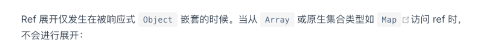

# 前端知识补充

## A. CSS width中的max-content,min-content,fit-content的区别

**max-content**

内容有多宽，盒子就有多宽，不会顾及父级盒子有多宽，只满足自己的需求。(也就是可能会超过父级元素的宽度)

**min-content**

装下单个最大内容的最小宽度。例如装下一个字母、一个汉字、一个div的最小宽度。

**fit-content**

在不超过父级盒子宽度的情况下，尽量撑开盒子满足自己的需求。

## B. CSS中的white-space、word-break、word-wrap

详情见：https://zhuanlan.zhihu.com/p/43601822

**white-space**属性是用来设置如何处理元素中的空白，同时还能控制是否自动换行。

**word-break**从这个名字可以知道，这个属性是控制单词如何被拆分换行的。

**word-wrap（overflow-wrap）**：**控制长度超过一行的单词是否被拆分换行**，是`word-break`的补充，它有两个值：`normal | break-word`，一般都用这个break-word。

下面是white-space的选值以及出现的效果：

### normal

连续的空白符会被合并，换行符会被当作空白符来处理。

### nowrap

和 normal 一样，连续的空白符会被合并。但文本内的换行无效。**永不换行**

### pre

和<pre>效果是一样的。都是预处理文本，你在代码中写的是什么样子，表现出来就是什么样子。

### pre-wrap

连续的空白符会被保留。在遇到换行符或者`<br>`元素才会换行。**保留空格和换行符，且可以自动换行。**

### pre-line

连续的空白符会被合并。在遇到换行符或者`<br>`元素，或者需要为了填充「行框盒子([line boxes](https://link.zhihu.com/?target=https%3A//www.w3.org/TR/CSS2/visuren.html%23inline-formatting))」时会换行。


Word-break有：

`word-break:keep-all`：**所有“单词”一律不拆分换行**，注意，我这里的“单词”包括连续的中文字符（还有日文、韩文等），或者可以理解为**只有空格可以触发自动换行**

`word-break:break-all`：**所有单词碰到边界一律拆分换行**，不管你是`incomprehensibilities`这样一行都显示不下的单词，还是`long`这样很短的单词，只要碰到边界，都会被强制拆分换行。所以用`word-break:break-all`时要慎重呀。

## C、Vue给对象新添加属性导致页面不刷新的原因及解决方法

`Vue.set`或者`this.$set`方法用来修改对象属性。如果要增加属性所属对象是响应式的，该方法可以确保属性被创建后也是响应式的，同时触发视图更新。同理，该方法也适用于数组对象(数组里边的值是对象)。


## D、Vue官网补充内容

### 1、响应式参数

值得注意的是只有当实例被创建时就已经存在于 `data` 中的 property 才是**响应式**的。也就是说如果你添加一个新的 property，比如：

```js
vm.b = 'hi'
```

那么对 `b` 的改动将不会触发任何视图的更新。

使用 `Object.freeze()`，这会阻止修改现有的 property，也意味着响应系统无法再*追踪*变化。

Vue 实例还暴露了一些有用的实例 property 与方法。它们都有前缀 `$`，以便与用户定义的 property 区分开来。

### 2、 `v-html` 指令：

```js
<p>Using mustaches: {{ rawHtml }}</p>
<p>Using v-html directive: <span v-html="rawHtml"></span></p>
```

`你的站点上动态渲染的任意 HTML 可能会非常危险，因为它很容易导致 [XSS 攻击]。请只对可信内容使用 HTML 插值，绝不要对用户提供的内容使用插值。`

### 3、**动态参数绑定**

从 2.6.0 开始，可以用方括号括起来的 JavaScript 表达式作为一个指令的参数：

```js
<a v-bind:[attributeName]="url"> ... </a>
```

这里的 `attributeName` 会被作为一个 JavaScript 表达式进行动态求值，求得的值将会作为最终的参数来使用。例如，如果你的 Vue 实例有一个 `data` property `attributeName`，其值为 `"href"`，那么这个绑定将等价于 `v-bind:href`。

同样地，你可以使用动态参数为一个动态的事件名绑定处理函数：

```js
<a v-on:[eventName]="doSomething"> ... </a>
```

在 DOM 中使用模板时 (直接在一个 HTML 文件里撰写模板)，还需要避免使用大写字符来命名键名，因为浏览器会把 attribute 名全部强制转为小写：

```js

//在 DOM 中使用模板时这段代码会被转换为 `v-bind:[someattr]`。
//除非在实例中有一个名为“someattr”的 property，否则代码不会工作。

<a v-bind:[someAttr]="value"> ... </a>
```

### 4、计算属性computed和监听watch

**计算属性有缓存**

计算属性默认只有 getter，不过在需要时你也可以提供一个 setter：

```js
// ...
computed: {
  fullName: {
    // getter
    get: function () {
      return this.firstName + ' ' + this.lastName
    },
    // setter--fullName改变时
    set: function (newValue) {
      var names = newValue.split(' ')
      this.firstName = names[0]
      this.lastName = names[names.length - 1]
    }
  }
}
// ...
```

**watch属性执行异步**

虽然计算属性在大多数情况下更合适，但有时也需要一个自定义的侦听器。这就是为什么 Vue 通过 `watch` 选项提供了一个更通用的方法，来响应数据的变化。当需要在数据变化时执行异步或开销较大的操作时，这个方式是最有用的。

### 5、元素复用

Vue 会尽可能高效地渲染元素，通常会复用已有元素而不是从头开始渲染。这么做除了使 Vue 变得非常快之外，还有其它一些好处。例如，如果你允许用户在不同的登录方式之间切换：

```js
<template v-if="loginType === 'username'">
  <label>Username</label>
  <input placeholder="Enter your username">
</template>
<template v-else>
  <label>Email</label>
  <input placeholder="Enter your email address">
</template>
```

那么在上面的代码中切换 `loginType` 将不会清除用户已经输入的内容。因为两个模板使用了相同的元素，`<input>` 不会被替换掉——仅仅是替换了它的 `placeholder`。

这样也不总是符合实际需求，所以 Vue 为你提供了一种方式来表达“这两个元素是完全独立的，不要复用它们”。只需添加一个具有唯一值的 `key` attribute 即可：

```js
<template v-if="loginType === 'username'">
  <label>Username</label>
  <input placeholder="Enter your username" key="username-input">
</template>
<template v-else>
  <label>Email</label>
  <input placeholder="Enter your email address" key="email-input">
</template>
```

### 6、v-show VS v-if

`v-if` 是“真正”的条件渲染，因为它会确保在切换过程中条件块内的事件监听器和子组件适当地被销毁和重建。

`v-if` 也是**惰性的**：如果在初始渲染时条件为假，则什么也不做——直到条件第一次变为真时，才会开始渲染条件块。

相比之下，`v-show` 就简单得多——不管初始条件是什么，元素总是会被渲染，并且只是简单地基于 CSS 进行切换。

一般来说，`v-if` 有更高的切换开销，而 `v-show` 有更高的初始渲染开销。因此，如果需要非常频繁地切换，则使用 `v-show` 较好；如果在运行时条件很少改变，则使用 `v-if` 较好。

注意，`v-show` 不支持 `<template>` 元素，也不支持 `v-else`。

**不推荐**同时使用 `v-if` 和 `v-for`。 当 `v-if` 与 `v-for` 一起使用时，`v-for` 具有比 `v-if` 更高的优先级。当它们处于同一节点，`v-for` 的优先级比 `v-if` 更高，这意味着 `v-if` 将分别重复运行于每个 `v-for` 循环中。

> `???`所以执行流程是`v-for`已经将所有的子list渲染完毕了，`v-if`如果为假，则又要重新销毁。

### 7、数组更新检测

Vue 不能检测以下数组的变动：

1. 当你利用索引直接设置一个数组项时，例如：`vm.items[indexOfItem] = newValue`
2. 当你修改数组的长度时，例如：`vm.items.length = newLength`

Vue 将被侦听的数组的**变更方法**（会变更调用了这些方法的原始数组）进行了包裹，所以它们也将会触发视图更新。这些被包裹过的方法包括：

- `push()`
- `pop()`
- `shift()`
- `unshift()`
- `splice()`
- `sort()`
- `reverse()`

相比之下，也有非变更方法，例如 `filter()`、`concat()` 和 `slice()`。它们不会变更原始数组，而**总是返回一个新数组**。当使用非变更方法时，可以用新数组替换旧数组：

```js
example1.items = example1.items.filter(function (item) {
  return item.message.match(/Foo/)
})
```

你可能认为这将导致 Vue 丢弃现有 DOM 并重新渲染整个列表。幸运的是，事实并非如此。Vue 为了使得 DOM 元素得到最大范围的重用而实现了一些智能的启发式方法，所以用一个含有相同元素的数组去替换原来的数组是非常高效的操作。

### 8、v-on事件修饰符

- `.stop`
- `.prevent`
- `.capture`
- `.self`
- `.once`
- `.passive`

```vue
<!-- 阻止单击事件继续传播 ：阻止冒泡 -->
// 当一个父元素div1 包裹着一个子元素div2 同时有点击事件，我们点击子元素，不想触发父元素的事件，我们可以采用阻止事件冒泡解决
<a v-on:click.stop="doThis"></a>

<!-- 提交事件不再重载页面 ：阻止原生事件 -->
<form v-on:submit.prevent="onSubmit"></form>

<!-- 修饰符可以串联 ：阻止冒泡又阻止原生事件-->
<a v-on:click.stop.prevent="doThat"></a>

<!-- 添加事件监听器时使用事件捕获模式 -->
<!-- 即内部元素触发的事件先在此处理，然后才交由内部元素进行处理 ：设置捕获模式-->
//当一个父元素div1 包裹着一个子元素div2 同时有点击事件。我们希望点击从外面执行到里面，先触发父元素再触发子元素。我们可以在父元素的点击事件加上
<div v-on:click.capture="doThis">...</div>

<!-- 只当在 event.target 是当前元素自身时触发处理函数 ：只有点击当前元素的时候，才会触发处理函数-->
//当只有点击自己本身元素才触发事件，忽略冒泡和捕获。
<div v-on:click.self="doThat">...</div>
```

使用修饰符时，顺序很重要；相应的代码会以同样的顺序产生。因此，用 `v-on:click.prevent.self` 会阻止**所有的点击**，而 `v-on:click.self.prevent` 只会阻止对元素自身的点击。

`.passive` 修饰符尤其能够提升移动端的性能。

不要把 `.passive` 和 `.prevent` 一起使用，因为 `.prevent` 将会被忽略，同时浏览器可能会向你展示一个警告。请记住，`.passive` 会告诉浏览器你*不*想阻止事件的默认行为。

### 9、v-model的修饰符

首先，v-model等同于什么？如下所示。

```js
<input v-model="searchText">
```

等价于：

```vue
<input
  v-bind:value="searchText"
  v-on:input="searchText = $event.target.value"
>
```


`.lazy`

在默认情况下，`v-model` 在每次 `input` 事件触发后将输入框的值与数据进行同步 。你可以添加 `lazy` 修饰符，从而转为在 `change` 事件之后进行同步：

```js
<!-- 在“change”时而非“input”时更新 -->
//当添加.lazy修饰符之后，改变input框中的内容并不会使得内容立刻发生变化，当输入框失去焦点后触发change事件.
<input v-model.lazy="msg">
```

`.number`

如果想自动将用户的输入值转为数值类型，可以给 `v-model` 添加 `number` 修饰符：

```js
<input v-model.number="age" type="number">
```

这通常很有用，因为即使在 `type="number"` 时，HTML 输入元素的值也总会返回字符串。如果这个值无法被 `parseFloat()` 解析，则会返回原始的值。

`.trim`

如果要自动过滤用户输入的首尾空白字符，可以给 `v-model` 添加 `trim` 修饰符：

```js
<input v-model.trim="msg">
```


### 10、监听子组件事件

父级组件可以通过 `v-on` 监听子组件实例的任意事件：

```html
<blog-post
  ...
  v-on:enlarge-text="postFontSize += 0.1"
  //简写形式如下
  @enlarge-text="postFontSize += 0.1"
></blog-post>
```

同时子组件可以通过调用内建的**`$emit`**方法并传入事件名称来触发一个事件：

```html
<button v-on:click="$emit('enlarge-text')">
  Enlarge text
</button>
```


### 11、vue中:is属性的使用

用法1：动态的切换组件 `:is`

可以通过 Vue 的 `<component>` 元素加一个特殊的 `:is` attribute 来实现：

例如：

```js
<div id="app">
    <button @click="changeComponent('component1')">组件1</button>
    <button @click="changeComponent('component2')">组件2</button>
     <!-- 通过is特性,可以动态切换当前组件  -->
    <div v-bind:is="currentView"></div>
      <!-- v-bind:动态绑定属性  -->
</div>

//引入组件
import component1 from '../....';
import component2 from '../....';
export default {
 data(){
 return {
    currentView:'component1'
     //当前组件
  } 
 },
 methods:{
     changeComponent(component){
     this.currentView=component;
         //点击按钮,动态切换不同的组件
    }
 }
 components:{
     component1,
     component2
 }
}

```

用法2：解析DOM模板时，解除限制元素

有些 HTML 元素，诸如 `<ul>`、`<ol>`、`<table>` 和 `<select>`，对于哪些元素可以出现在其内部是有严格限制的。而有些元素，诸如 `<li>`、`<tr>` 和 `<option>`，只能出现在其它某些特定的元素内部。

这会导致我们使用这些有约束条件的元素时遇到一些问题。例如：

```html
<table>
  <blog-post-row></blog-post-row>
</table>
```

这个自定义组件 `<blog-post-row>` 会被作为无效的内容提升到外部，并导致最终渲染结果出错。幸好这个特殊的 `is` attribute 给了我们一个变通的办法：

```html
<table>
  <tr is="blog-post-row"></tr>
</table>
```

### 12、props

props只能从父组件数据流向子组件，并且改props不可改变(即只读)，倘若子组件想要更改并使用props的值，那么可以在data中自定义一个新的值。例如：

```js
props: ['initialCounter'],
data: function () {
  return {
    counter: this.initialCounter
  }
}
```

**注意**在 JavaScript 中对象和数组是通过引用传入的，所以对于一个数组或对象类型的 prop 来说，在子组件中改变变更这个对象或数组本身**将会**影响到父组件的状态。所以Vue不推荐在子组件中改变props。

### 13、动态组件

我们之前在一个多标签的界面中使用 `is` attribute 来切换不同的组件：

当在这些组件之间切换的时候，你有时会想保持这些组件的状态，以避免反复重新渲染导致的性能问题。

我们更希望那些标签的组件实例能够被在它们第一次被创建的时候缓存下来。为了解决这个问题，我们可以用一个 `<keep-alive>`元素将其动态组件包裹起来。

```js
<!-- 失活的组件将会被缓存！-->
<keep-alive>
  <component v-bind:is="currentTabComponent"></component>
</keep-alive>
```

另外，`$refs` 只会在组件渲染完成之后生效，并且它们不是响应式的。这仅作为一个用于直接操作子组件的“逃生舱”——你应该避免在模板或计算属性中访问 `$refs`。

### 14、Vue动画

#### 过渡的类名

在进入/离开的过渡中，会有 6 个 class 切换。

1. `v-enter`：开始动画进入时的css。

2. `v-enter-active`：开始动画过渡的css。

3. `v-enter-to`：开始动画结束后的css。

4. `v-leave`：离开动画进入时的css。

5. `v-leave-active`：离开动画过渡的css。

6. `v-leave-to`：离开动画结束后的css。

   如果你使用了 `<transition name="my-transition">`，那么 `v-enter` 会替换为 `my-transition-enter`。


可以通过 `appear` attribute 设置节点在初始渲染的过渡

```vue
<transition appear>
  <!-- ... -->
</transition>
```

当有**相同标签名**的元素切换时，需要通过 `key` attribute 设置唯一的值来标记以让 Vue 区分它们，否则 Vue 为了效率只会替换相同标签内部的内容。即使在技术上没有必要，**给在 `<transition>` 组件中的多个元素设置 key 是一个更好的实践。**

例如

```js
<transition>
  <button v-if="isEditing" key="save">
    Save
  </button>
  <button v-else key="edit">
    Edit
  </button>
</transition>
```

#### 过渡模式

`<transition>` 的默认行为 - 进入和离开同时发生。

同时生效的进入和离开的过渡不能满足所有要求，所以 Vue 提供了**过渡模式**

- `in-out`：新元素先进行过渡，完成之后当前元素过渡离开。
- `out-in`：当前元素先进行过渡，完成之后新元素过渡进入。

```js
<transition name="fade" mode="out-in">
  <!-- ... the buttons ... -->
</transition>
```

**多个组件的过渡：**

多个组件的过渡简单很多 - 我们不需要使用 `key` attribute。相反，我们只需要使用`动态组件`：

```js
<transition name="component-fade" mode="out-in">
  <component v-bind:is="view"></component>
</transition>
```

**列表过渡：**

怎么同时渲染整个列表，比如使用 `v-for`？在这种场景中，使用 `<transition-group>` 组件。在我们深入例子之前，先了解关于这个组件的几个特点：

- 不同于 `<transition>`，它会以一个真实元素呈现：默认为一个 `<span>`。你也可以通过 `tag` attribute 更换为其他元素。
- [过渡模式](https://v2.cn.vuejs.org/v2/guide/transitions.html#过渡模式)不可用，因为我们不再相互切换特有的元素。
- 内部元素**总是需要**提供唯一的 `key` attribute 值。
- CSS 过渡的类将会应用在内部的元素中，而不是这个组/容器本身。


**列表的排序过渡：**

`<transition-group>` 组件还有一个特殊之处。不仅可以进入和离开动画，还可以改变定位。要使用这个新功能只需了解新增的 **`v-move` class**，它会在元素的改变定位的过程中应用。像之前的类名一样，可以通过 `name` attribute 来自定义前缀，也可以通过 `move-class` attribute 手动设置。

这个看起来很神奇，内部的实现，Vue 使用了一个叫 [FLIP](https://aerotwist.com/blog/flip-your-animations/) 简单的动画队列
使用 transforms 将元素从之前的位置平滑过渡新的位置。

```js
<script src="https://cdnjs.cloudflare.com/ajax/libs/lodash.js/4.14.1/lodash.min.js"></script>

<div id="flip-list-demo" class="demo">
  <button v-on:click="shuffle">Shuffle</button>
  <transition-group name="flip-list" tag="ul">
    <li v-for="item in items" v-bind:key="item">
      {{ item }}
    </li>
  </transition-group>
</div>


<style>
      
   //#new
  .flip-list-move {
  transition: transform 1s;
}
```

需要注意的是使用 FLIP 过渡的元素不能设置为 `display: inline` 。作为替代方案，可以设置为 `display: inline-block` 或者放置于 flex 中。


### 15、mixin混入

当组件和混入对象含有同名选项时，这些选项将以恰当的方式进行“合并”。比如，**数据对象**在内部会进行递归合并，并在发生冲突时以组件数据优先。

同名**生命周期钩子函数**将合并为一个数组，因此都将被调用。另外，混入对象的钩子将在组件自身钩子**之前**调用。

值为对象的选项，例如 `methods`、`components` 和 `directives`，将被合并为同一个对象。两个对象键名冲突时，取**组件对象**的键值对。


### 16、自定义指令

```js
// 注册一个全局自定义指令 `v-focus`
Vue.directive('focus', {
  // 当被绑定的元素插入到 DOM 中时……
  inserted: function (el) {
    // 聚焦元素
    el.focus()
  }
})
```

一个指令定义对象可以提供如下几个钩子函数 (均为可选)：

- `bind`：只调用一次，指令第一次绑定到元素时调用。在这里可以进行一次性的初始化设置。
- `inserted`：被绑定元素插入父节点时调用 (仅保证父节点存在，但不一定已被插入文档中)。
- `update`：所在组件的 VNode 更新时调用。
- `componentUpdated`：指令所在组件的 VNode **及其子 VNode** 全部更新后调用。
- `unbind`：只调用一次，指令与元素解绑时调用。
- `el`：指令所绑定的元素，可以用来直接操作 DOM。


### 17、Vue.$nextTick()

当数据更新了，在**dom**中渲染后，自动执行该函数。

```js
 methods:{
    testClick:function(){
      let that=this;
      that.testMsg="修改后的值";
      that.$nextTick(function(){
        console.log(that.$refs.aa.innerText);  //输出：修改后的值
      });
    }
```

Vue 实现响应式并不是数据发生变化之后 DOM 立即变化，而是按一定的策略进行 DOM 的更新。$nextTick 是在下次 DOM 更新循环结束之后执行延迟回调，在修改数据之后使用 $nextTick，则可以在回调中获取更新后的 DOM。

`什么时候需要使用到 nextTick ？`

1、Vue生命周期的created()钩子函数进行的DOM操作一定要放在Vue.nextTick()的回调函数中，原因是在created()钩子函数执行的时候DOM 其实并未进行任何渲染，而此时进行DOM操作无异于徒劳，所以此处一定要将DOM操作的js代码放进Vue.nextTick()的回调函数中。
2、当项目中你想在**改变DOM元素的数据后**基于新的dom做点什么，**对新DOM一系列的js操作都需要放进Vue.nextTick()的回调函数中；**通俗的理解是：更改数据后当你想立即使用js操作新的视图的时候需要使用它。

## E、Vue路由

### VUE2路由

https://juejin.cn/post/6844903665388486664?searchId=202307211122496D1D3657EC884C919346#heading-46

https://pythonjishu.com/dpdykfgupswqjrb/

### VUE3 路由和VUE2的不同点

`下载的区别:` npm i -s vue-router@4

`创建的区别:`

`./router/index.js` 路径中引入router的方式改为了`import { createRouter,createWebHistory,createWebHashHistory } from 'vue-router';`（Vue2是  **import** **Router** **from** 'vue-router';）

创建时为：

```js
//vue3
const myRouter = createRouter({
    history:createWebHashHistory(),
    // hash:createWebHashHistory,
    // base:'',
    routes
})
//vue2
// const myRouter = new Router({
//    mode:'hash',//history,
//    base:'',
//    routes
// })
```

`Main.js`使用：

```js
import myRouter from './router/index.js'
createApp(App).use(myRouter).mount('#app')
```


### router、routes、route的区别

- router:一般指的就是路由实例.如$router.`$router`是指整个**路由实例**,你可以操控整个路由,通过'$router.push'往其中添加任意的路由对象.
- routes:指router路由实例的routes API.用来配置多个route路由对象.
- route:指的就是路由对象.例如;$route指的就是当前路由对象.`$route`:是指当前路由实例('$router')跳转到的**路由对象**;


## F、VueX

建议使用Pinia  ==> H

## G、Vue3

导航：https://juejin.cn/post/7164159759619194893

### 1、vite使用

```js
npm init vite@latest my-vue-app -- --template vue
```

my-vue-app 是项目名称 template vue 是创建一个vue模板

```js
npm install
```

npm install 安装依赖

```js
npm run dev
```

npm run dev 本地启动


### 2、组合式API

#### - setup

**setup函数是 Composition API（组合API）的入口**

```js
<script>
 export default {
  name: 'App',
  setup(){
   let name = '流星'
   let age = 18
   //方法
   function say(){
    console.log(`我叫${name},今年${age}岁`)
   }

   //返回一个对象
   return {
    name,
    age,
    say
   }
  }
 }
</script>

```

注意，以上代码内容并非是**响应式**的。另外，还有一种Vue3的语法糖`<script setup>`，就相当于在编译运行是把代码放到了 setup 函数中运行，然后把导出的变量定义到上下文中，并包含在返回的对象中。

```js
<script setup>
  ...
</script>
```

#### - `<script setup>`语法糖：

- 组件直接引入即可使用，无需注册

  ```vue
  <script setup>
    import Foo from './components/Foo.vue'
  </script>
  ```

- 属性和方法无需挂载到对象上后再次返回

```vue
<script setup>
  import { ref } from 'vue'
  import Foo from './components/Foo.vue'

  const count = ref(0)
  const increment = () => count.value++
  //return???
</script>
```

- `props和emit`

```js
import { useContext, defineProps, defineEmit } from 'vue'
// 接收props,并返回一个对象，可以在js中使用props来获取传入的数据
  const props = defineProps({
    count: {
      type: Number,
      default: 0
    }
  })
  // 声明需要触发的事件，返回一个emit函数，作用和this.$emit函数的作用是一致的
  const emit = defineEmits(['increment', 'decrement'])
```

其中`defineProps`用来接收父组件传来的值props。`defineEmit`用来声明触发的事件表。`useContext`用来获取组件上下文context。**注意引入三个API的顺序**

> 更新：关于 useContext 已经弃用了,废除了这个语法,被拆分成 useAttrs 和 useSlots


defineProps 和 defineEmits以及defineExpose 是编译器宏（compiler macros ）

只能在 `<script setup>` 中使用。它们不需要被导入，并且在处理 `<script setup>` 时被编译掉。

传递给 defineProps 和 defineEmits 的选项将被从 setup 中提升到模块范围。 **在模板template中可以不加props，即props.xxx => xxx 即可。**

因此，这些选项不能引用在 setup 作用域内声明的局部变量。这样做会导致一个编译错误。

**props里面的default**：

​	使用：

```js
obj: {
		type:Object,
		default:() => ({})
	}
```

​	default的作用是 **default里面设置得原来是没有任何值的时候默认的值。** 	

> **为什么需要用函数的形式？**
>
> ​	因为对象和数组都是属于我们的复杂类型，在进行访问指向的时候我们使用的是对象和数组的地址，而不像基础数据类型那。
>
> ​	如果我们没有通过函数的形式去设置对象和数据类型的默认值，而是直接采用{}和[],如果多个使用该组件的地方因为没有传递props而使用了默认值，假设其中一个地方我们修改了默认的值（不推荐，会报警告，不符合反向数据流），那么其他的地方由于指向的是同一个内存中的引用地址，其他地方的显示值也会发生修改
>
> ​	我们使用了函数的形式去返回，保证每次函数执行出来的都是返回一个新的对象，这样就不会出现上面所有的情况
>
> **Vue中Prop默认值为什么要为工厂函数的形式返回**？
>
> ​	工厂函数的的形式就类似于()=>''这种箭头函数之类的形式，

- `slots和attrs`

如果你确实需要它们，请分别使用 useSlots 和 useAttrs 帮助函数（helpers）

useSlots 和 useAttrs 是实际的运行时函数，其返回值等价于 `setupContext.slots` 和 `setupContext.attrs`。它们也可以在 Composition API 函数中使用。

```js
<script setup>
  import { useSlots, useAttrs } from 'vue'

  const slots = useSlots()
  const attrs = useAttrs()
</script>
```

 **-- DefineExpose的用法及作用：**

​	Vue3中使用 `<script setup> `语法糖的组件是默认关闭的，也即通过模板 ref 或者 $parent 链获取到的组件的公开实例，不会暴露任何在` <script setup>`中声明的绑定。 为了在 `<script setup>` 语法糖组件中明确要暴露出去的属性，使用 defineExpose 编译器宏将需要暴露出去的变量与方法放入暴露出去就可以.

`使用方法：`

在子组件中:

将需要暴露给父组件的数据或者方法写在此处：

```js
defineExpose({

暴露的数据,

暴露的方法,

})

```

**注意：**defineExpose要写在暴露的数据和方法的后面。

在父组件中：

```js
<子组件 ref="son"></子组件>
...
const son = ref();
...
//使用:
son.暴露的方法/暴露的数据;
```

**注意：**父组件在使用子组件暴露的方法或者数据时，要确保子组件已经加载。


#### - **setup几个注意点**

- 它比`beforeCreate`和`created`这两个生命周期还要**快**，就是说，setup在`beforeCreate,created`前，它里面的this打印出来是`undefined`
- setup可以接受两个参数，第一个参数是`props`,也就是组件传值，第二个参数是`context`,上下文对象，`context`里面还有三个很重要的东西`attrs`，`slots`,`emit`，它们就相当于vue2里面的`this.$attrs`,`this.$slots`,`this.$emit`。

​			使用插槽时，不能使用 `slot="XXX"`,要使用`v-slot:demo`，不然会报错


#### - ref

`ref`可以将数据变成响应式数据，但是如果我们直接在代码里面修改是修改不了的，ref把它们变成了对象 并且还是`RefImpl`的实例对象。赋予的值在对象.value里面。

> 注意：`ref`最好只用在常规数据(非对象)。对象数据可以使用别的更方便。

需要首先引入`ref`: import {ref} from 'vue'

在需要做响应式数据上加上`ref`: let data = ref(1001);

所以，在修改的时候要.value去修改，里面还是走的get与set去修改页面.Data.value = 1002;

其实按道理的话，我们在页面上用的话应该要`{{name.value}}`显示的，但是因为vue3检测到你是ref对象，它就自动给你.value了

> 那么要是我定义的ref是个对象呢，因为我们知道尽管ref后会变成`RefImpl`的实例对象，所以我们就用`XX.value.xx`进行修改。`这样会比较麻烦，不建议这样使用`

> **定义对象**：：：但是我们打印job.value,你会发现，它不再是`RefImpl`实例对象，变成了`Proxy`实例对象，他只是vue3底层把对象都变成了`Proxy`实例对象，对于基本数据类型就是按照`Object.defineProperty`里面的`get`和`set`进行数据劫持然后进行响应式，但是如果是对象类型的话，是用到的`Proxy`，但是vue3把它封装在新函数**reactive**里，就相当于，ref中是对象的，自动会调用**reactive**。

#### - reactive

> reactive只能定义对象类型的响应式数据，前面说到的ref里是对象的话，会自动调用**reactive**，把`Object`转换为`Proxy`，那我们来打印一下，你会发现就直接变成了`Proxy`，之前为什么会.value呢，是因为要去获取值，然后通过**reactive**变成`Proxy`，但是现在是直接通过**reactive**变成`Proxy`，而且它是进行的一个深层次的响应式，也可以进行数组的响应式。


#### - ref 与 reactive的区别

- ref用来定义：**基本类型数据**。

- ref通过`Object.defineProperty()`的`get`与`set`来实现响应式（数据劫持）。

- ref定义的数据：操作数据需要`.value`，读取数据时模板中直接读取不需要`.value`。

- reactive用来定义：**对象或数组类型数据**。

- reactive通过使用**Proxy**来实现响应式（数据劫持）, 并通过**Reflect**操作源代码内部的数据。

- reactive定义的数据：操作数据与读取数据：均不需要`.value`。 当然，ref可以定义对象或数组的，它只是内部自动调用了**reactive**来转换。


#### - vue3的响应式原理

说到vue3的响应式原理，那我们就不得不提一句vue2的响应式了，（狗都知道的一句）通过`Object.defineProperty`的`get`，`set`来进行数据劫持，修改，从而响应式,但是它有什么缺点呢😶

- 由于只有get()、set() 方式，所以只能捕获到属性读取和修改操作，当 新增、删除属性时，捕获不到，导致界面也不会更新。
- 直接通过下标修改数组，界面也不会自动更新。（虽然Vue2可以实现，但是会有性能问题）

对于vue3中的响应式，我们用到的**Proxy**，当然，我们在vue2里面知道，**Proxy**是什么，是代理，当然，并不是只用到了它，还有个Window上的内置对象`Reflect（反射）`

- 通过Proxy（代理）: 拦截对象中任意属性的变化, 包括：属性值的读写、属性的添加、属性的删除等。
- 通过Reflect（反射）: 对源对象的属性进行操作。

```js
const p=new Proxy(data, {
// 读取属性时调用
    get (target, propName) {
    	return Reflect.get(target, propName)
    },
//修改属性或添加属性时调用
    set (target, propName, value) {
    	return Reflect.set(target, propName, value)
    },
//删除属性时调用
    deleteProperty (target, propName) {
    	return Reflect.deleteProperty(target, propName)
    }
}) 

```


#### - computed

在vue3中，把`computed`变成为组合式API，那么就意味着你要去引入它。

写法：

```js
let fullWish = computed(()=>{
        return mywish.value + '---' + mywant.value;
    })
```

但是当你去尝试修改`fullWish`的时候会发现他是一个只读属性。

那要是我们想要修改怎么办呢,那么就要用到`computed`的终结写法了

```js
let fullWishEditalbe = computed({
        get(){
        return mywish.value + '---' + mywant.value;
        },
        set(newValue){
            mywish.value = newValue.split('---')[0];
            mywant.value = newValue.split('---')[1];
        }
    })

fullWishEditalbe.value = 'XXXX---QQQQ';
```

#### - watch

`watch`也是组合式API。

监听`ref`数据 ：

写法：

```js
watch(nums,(newV,oldV)=>{
        console.log("当前数字：",newV,"之前数字",oldV);
    })
```

当然这是监听`ref`定义出来的单个响应式数据，要是监听多个数据应该怎么办呢？其实可以写多个`watch`去进行监听，当然这不是最好的方法，最好的办法其实是监视数组。

写法：

```js
 watch([num,msg],(newValue,oldValue)=>{
      console.log('当前改变了',newValue,oldValue)
    })
```

当然之前在vue2中`watch`有其他参数,比如`immediate、deep`，vue3中也有,是写在最后的。

写法：

```js
watch([num,msg],(newValue,oldValue)=>{
  console.log('当前改变了',newValue,oldValue)
},{immediate:true,deep:true})
```

那么要是我们监听的是`reactive`：

你会发现一个问题，为什么`newValue`与`oldValue`一样呢，就很尴尬，都是新的数据，就算你使用`ref`来定义，还是没有办法监听到`oldValue`（`ref`定义的对象会自动调用`reactive`）,所以**在监视reactive定义的响应式数据时，oldValue无法正确获取**,并且你会发现，它是**强制开启深度监视（`deep:true`），并且无法关闭。**

然而现在我们监视的是`reactive`定义的响应式数据的全部属性，如果想只监听其中的一个属性，那怎么办呢，可能大家会

```js
watch(names.age,(newValue,oldValue)=>{
  console.log(`names改变了`,newValue,oldValue)
})
```

来进行监视，但是，vue3会警告**只能监听`reactive`定义的或者`ref`定义的**,并且不能监听。

那么我们就必须这样写:

```js
watch(()=>names.age,(newValue,oldValue)=>{
  console.log('names改变了',newValue,oldValue)
})
```

那么要是我们监听的是多个属性，依旧是写成数组的形式。

```js
watch([()=>names.age,()=>names.familyName],(newValue,oldValue)=>{
  console.log('names改变了',newValue,oldValue)
})
```

要是我们监听的是深度的属性那要怎么办呢？你会发现我要是只监听第一层是监听不到的，那么我们有两种写法

```js
//第一种
watch(()=> names.job.salary,(newValue,oldValue)=>{
  console.log('names改变了',newValue,oldValue)
})
//第二种
watch(()=> names.job,(newValue,oldValue)=>{
  console.log('names改变了',newValue,oldValue)
},{deep:true})
```

**如果监视的是`reactive`定义的响应式数据的属性，并且这个属性是对象，那么我们可以开启深度监视**


#### - watchEffect

`watchEffect`是vue3的新函数，它是来和`watch`来抢饭碗的，它和`watch`是一样的功能。那它有什么优势呢？

- 自动默认开启了`immediate:true`
- 用到了谁就监视谁
- 无法开启`deep`

写法：

```js
 watchEffect(()=>{
        const w = student.name;
        console.log("watchEffet用到了student.name,所以监听了");
    })
```

在 Vue 3 中，您可以使用 `watchEffect` 函数来观察响应式状态的变化并执行副作用代码。`watchEffect` 函数会自动追踪其内部使用的响应式数据，并在任何被追踪的数据发生变化时重新运行副作用代码。

下面是 `watchEffect` 的使用示例：

```javascript
import { watchEffect, reactive } from 'vue';

const state = reactive({
  count: 0
});

watchEffect(() => {
  console.log('count 的值发生了变化:', state.count);
});

// 修改 count 的值
state.count++; // 输出：count 的值发生了变化: 1
state.count = 5; // 输出：count 的值发生了变化: 5
```

在这个示例中，我们首先使用 `reactive` 函数创建了一个响应式对象 `state`，其中包含一个属性 `count`。然后，我们使用 `watchEffect` 函数来创建一个副作用代码块。在副作用代码块中，我们输出 `count` 的值。

当我们修改 `count` 的值时，`watchEffect` 会自动追踪这个变化，并重新运行副作用代码。在控制台中，我们可以看到每次 `count` 的值发生变化时都会打印出相应的消息。

`watchEffect` 还返回一个清理函数，可以用于停止观察副作用。您可以将清理函数存储在变量中，并在需要停止观察时调用它。

```javascript
import { watchEffect, reactive } from 'vue';

const state = reactive({
  count: 0
});

const stop = watchEffect(() => {
  console.log('count 的值发生了变化:', state.count);
});

// 修改 count 的值
state.count++; // 输出：count 的值发生了变化: 1

// 停止观察副作用
stop();
```

在这个示例中，我们将 `watchEffect` 返回的清理函数存储在 `stop` 变量中，并在需要停止观察时调用它。

在 Vue 3 中，`watchEffect` 函数接受一个可选的 `flush` 参数，用于控制副作用代码的执行时机。

`flush` 参数有以下几个选项：

- `"pre"`：在 DOM 更新之前立即执行副作用代码。
- `"post"`：在 DOM 更新之后执行副作用代码。
- `"sync"`：在 DOM 更新之前和之后都执行副作用代码。

默认情况下，`watchEffect` 的 `flush` 参数为 `"post"`，意味着副作用代码会在 DOM 更新之后执行。

以下是使用 `flush` 参数的示例：

```javascript
import { watchEffect, reactive } from 'vue';

const state = reactive({
  count: 0
});

watchEffect(() => {
  console.log('count 的值发生了变化:', state.count);
}, { flush: 'pre' });

// 修改 count 的值
state.count++; // 输出：count 的值发生了变化: 1
```

在这个示例中，我们将 `flush` 参数设置为 `"pre"`，这意味着副作用代码会在 DOM 更新之前立即执行。因此，在修改 `count` 的值后，我们会立即看到相应的输出。

您可以根据需要选择适合的 `flush` 参数。如果您需要在 DOM 更新之前执行副作用代码，可以将 `flush` 设置为 `"pre"`。如果您需要在 DOM 更新之后执行副作用代码，可以将 `flush` 设置为 `"post"`。如果您希望在 DOM 更新之前和之后都执行副作用代码，可以将 `flush` 设置为 `"sync"`。


在 Vue 3 中，`watchEffect` 函数还有一个名为 `onTrack` 的选项，用于在副作用代码运行之前执行回调函数。这个回调函数会接收一个追踪函数作为参数，可以用于获取当前追踪的依赖项。

以下是使用 `onTrack` 选项的示例：

```javascript
import { watchEffect, reactive } from 'vue';

const state = reactive({
  count: 0
});

watchEffect(
  () => {
    console.log('count 的值发生了变化:', state.count);
  },
  {
    onTrack: (event) => {
      console.log('追踪的依赖项:', event);
    }
  }
);

// 修改 count 的值
state.count++; // 输出：
// 追踪的依赖项: { effect: /* effect 对象 */, target: /* 响应式对象 */, type: "get", key: "count" }
// count 的值发生了变化: 1
```

在这个示例中，我们使用 `onTrack` 选项来定义一个回调函数。在回调函数中，我们打印出追踪的依赖项的相关信息。在修改 `count` 的值后，我们可以看到在副作用代码运行之前，会先打印出追踪的依赖项的信息。

请注意，`onTrack` 选项只在 Vue 3.2.0 及以上版本中可用。


> 无论是在watch还是在watchEffect里面，函数中都可以接收一个`onCleanup`参数，watch的cleanup是回调的第三个参数，watchEffect()是回调的第一个参数，看看文档对cleanUp这个函数的描述：
>
>  **watch：**watch其实可以接收三个参数，分别是oldValue、newValue、以及`onCleanup`。`onCleanup` 是一个函数，接收一个**方法**作为参数，在下一次 `watch` 的回调执行前执行传入的回调。
>
> **watchEffect:**watchEffect其实也可以接收到`onCleanup`参数，`watchEffect((onCleanUp)=>{})`

功能:主要用于清除副作用，主要用于异步任务中。例如在watch、watchEffect中，监听一个按钮，按钮按下则发送一个请求并获取数据。假设我们连点了两次，发送了两个请求A、B，假设在极端情况下，A耗时大于B，导致最终A请求的结果会覆盖B请求的结果，这时就可以用onCleanup函数清除副作用。

```js
watch(()=>count.value,(value,oldvalue,onCleanup)=>{
  console.log("进入了watch");
  onCleanup(()=>{
    console.log("执行了onCleanup..");
  })
})
```

上述函数在第一次执行时会触发"进入了watch"

在第二次进入时，会触发"执行了onCleanup.."，然后再触发"进入了watch"。


#### - 生命周期

我们先来简单分析下，在vue2中，我们是先`new Vue()`，然后执行`beforeCreate`与`created`接着问你有没有`vm.$mount(el)`，有，才继续执行，但是在vue3中，它是先全部准备好后然后再进行函数。

其实在vue3中生命周期没有多大的改变，只是改变了销毁和销毁前，让它更加语义化了

- **`beforeDestroy`改名为`beforeUnmount`,`destroyed`改名为`unmounted`**

- **`beforeCreate`与`created`并没有组合式API中,`setup`就相当于这两个生命周期函数**
- **在vue3中也可以按照之前的生命周期函数那样写，只是要记得有些函数名称发生了改变**
  - `beforeCreate`===>`Not needed*`
  - `created`====>`Not needed*`
  - `beforeMount` ===>`onBeforeMount`
  - `mounted`====>`onMounted`
  - `beforeUpdate`===>`onBeforeUpdate`
  - `updated` ====>`onUpdated`
  - `beforeUnmount` ==>`onBeforeUnmount`
  - `unmounted` ==>`onUnmounted`


#### - hooks函数

- Vue3 的 hook函数 相当于 vue2 的 mixin, 不同在与 hooks 是函数
- Vue3 的 hook函数 可以帮助我们提高代码的复用性, 让我们能在不同的组件中都利用 hooks 函数

其实就是代码的复用，可以用到外部的数据，生命钩子函数...

```js
//一般都是建一个hooks文件夹，都写在里面 文件名:useMousePosition.js
import {reactive,onMounted,onBeforeUnmount} from 'vue'
export default function (){
   //鼠标点击坐标
   let point = reactive({
      x:0,
      y:0
   })

   //实现鼠标点击获取坐标的方法
   function savePoint(event){
      point.x = event.pageX
      point.y = event.pageY
      console.log(event.pageX,event.pageY)
   }

   //实现鼠标点击获取坐标的方法的生命周期钩子
   onMounted(()=>{
      window.addEventListener('click',savePoint)
   })

   onBeforeUnmount(()=>{
      window.removeEventListener('click',savePoint)
   })

   return point
}
//在其他地方调用
import useMousePosition from './hooks/useMousePosition'
let point = useMousePosition（）
```

#### - hooks使用注意点 ！important

> https://cn.vuejs.org/guide/reusability/composables.html#conventions-and-best-practices
>
> ​	在使用hooks的时候，遵循useXxx的命名规范。另外，在使用hooks的时候，最好是定义/使用/返回 响应式定义的数据(ref/reactive)，因为如果返回的是普通变量，他没有响应式，并不会根据时间的变化而变化，返回的始终是一个固定值，特别是在处理异步函数的时候，一定要使用响应式定义的变量。
>
> ​	另外，如果该hooks用到了传参，那么参数请也尽量使用响应式定义数据，这样，在传入到hooks里面之后，hooks里面使用watcheffect/watch/computed进行监听之后就可以在传入的参数改变后进行相应的改变了。
>
> 
>
> **返回值**
>
> 你可能已经注意到了，我们一直在组合式函数中使用 `ref()` 而不是 `reactive()`。我们推荐的约定是组合式函数始终返回一个包含多个 ref 的普通的非响应式对象，这样该对象在组件中被解构为 ref 之后仍可以保持响应性：
>
> ```js
> // x 和 y 是两个 ref
> const { x, y } = useMouse()
> ```
>
> 从组合式函数返回一个响应式对象会导致在对象解构过程中丢失与组合式函数内状态的响应性连接。与之相反，ref 则可以维持这一响应性连接。
>
> 如果你更希望以对象属性的形式来使用组合式函数中返回的状态，你可以将返回的对象用 `reactive()` 包装一次，这样其中的 ref 会被自动解包，例如：
>
> ```js
> const mouse = reactive(useMouse())
> // mouse.x 链接到了原来的 x ref
> console.log(mouse.x)
> ```
>
> ```js
> Mouse position is at: {{ mouse.x }}, {{ mouse.y }}
> ```

#### - toRef与toRefs


	`toref` 就是将一个非响应式的数据变成响应式的。(注意是返回回来，需要接收)
	`toRefs` 是 Vue 3 中的一个实用函数，用于将响应式对象转换为一个由响应式对象属性的浅层次 ref 组成的普通对象。

使用 `toRefs` 可以将响应式对象的属性解构为独立的 ref，这样可以在模板中更方便地访问和使用这些属性。

下面是一个使用 `toRefs` 的示例：

```javascript
import { reactive, toRefs } from 'vue';

const state = reactive({
  count: 0,
  message: 'Hello'
});

const refs = toRefs(state);

console.log(refs.count.value); // 访问 count 属性的值
console.log(refs.message.value); // 访问 message 属性的值
```

在这个示例中，我们首先创建了一个响应式对象 `state`，它包含了 `count` 和 `message` 两个属性。然后，我们使用 `toRefs` 将 `state` 转换为一个由 ref 组成的普通对象 `refs`。

通过 `refs.count.value` 和 `refs.message.value`，我们可以分别访问 `count` 和 `message` 属性的值。这是因为 `toRefs` 将每个属性都转换为了一个 ref，我们需要通过 `.value` 来访问 ref 的值。

在模板中使用 `toRefs` 也非常方便。例如，在 Vue 组件的模板中，我们可以直接使用解构语法来访问 `toRefs` 转换后的属性：

```html
<template>
  <div>
    <p>Count: {{ count }}</p>
    <p>Message: {{ message }}</p>
  </div>
</template>

<script>
import { reactive, toRefs } from 'vue';

export default {
  setup() {
    const state = reactive({
      count: 0,
      message: 'Hello'
    });

    const refs = toRefs(state);

    return { ...refs };
  }
}
</script>
```

在这个示例中，我们在 `setup` 函数中使用 `toRefs` 将响应式对象 `state` 转换为 `refs` 对象，并通过 `return { ...refs }` 将 `refs` 对象中的属性返回给模板使用。

对于嵌套的对象使用toRefs()，也会使解构出来的对象成为一个ref对象，具有响应式(即使ref对象的底层仍然使用reactive，但是你在访问和修改时仍然需要使用.value)

### 3、其他组合式API

#### - shallowReactive 与 shallowRef

`shallowReactive`浅层次的响应式,它就是只把第一层的数据变为响应式，深层的数据 不会变为响应式,`shallowRef`如果定义的是基本类型的数据，那么它和`ref`是一样的不会有什么改变，但是要是定义的是对象类型的数据，那么它就不会进行响应式，之前我们说过如果`ref`定义的是对象，那么它会自动调用`reactive`变为`Proxy`,但是要是用到的是`shallowRef`那么就不会调用`reactive`去进行响应式。

**shallowReactive：只处理对象最外层属性的响应式（浅响应式）。** **shallowRef：只处理基本数据类型的响应式, 不进行对象的响应式处理。**

#### - readonly 与 shallowReadonly

`readonly`是接收了一个响应式数据然后重新赋值，返回的数据就不允许修改（深层只读）

`shallowReadonly`却只是浅层只读（第一层只读，其余层可以进行修改）

#### - toRaw 与 markRaw

`toRaw`其实就是将一个由`reactive`生成的**响应式对象**转为**普通对象**。如果是`ref`定义的话，是没有效果的（包括`ref`定义的对象）**如果在后续操作中对数据进行了添加的话，添加的数据为响应式数据**，当然要是将数据进行`markRaw`操作后就不会变为响应式，可能大家会说，不就是和`readonly`一样吗？那肯定不一样咯，`readonly`是根本没办法改，但`markRaw`是不转化为响应式，但是数据还会发生改变。

#### - customRef

**`customRef`创建一个自定义的 ref，并对其依赖项跟踪和更新触发进行显式控制。**纯觉得这个东西的作用只有防抖的作用（要是知道其他的用法可以告知一下我）

#### - provide 与 inject

都知道组件传值吧，在vue2中，如果要在后代组件中使用父组件的数据，那么要一层一层的父子组件传值或者用到`vuex`，但是现在，无论组件层次结构有多深，父组件都可以作为其所有子组件的依赖提供者。这个特性有两个部分：父组件有一个 `provide` 选项来提供数据，子组件有一个 `inject` 选项来开始使用这些数据。

**适用于祖孙组件。**


**请 进一步了解provide与inject!**

provide与inject其实是双向绑定的,即你在子组件中修改了父组件传给你的数据,那么父组件也会监听并更新该值.

provide与inject最标准的写法应该是这样:

```js
//provide
const count = ref(1);
const changeValue = () => {
  count.value = 10;
}
provide("provide",{
  count,
  changeValue,
});

//inject
const {count,changeValue} = inject("provide");
```

将数据与更改数据的方法一并传给子孙组件,这样,在修改的时候就知道在哪个父组件中进行了修改.(当然,不传修改方法,直接在子组件中进行修改也是可以的.)

那么就有这样一种想法==>如何父组件的数据传给子组件后,子组件在进行修改的时候不会触发父组件的更新呢? 即单向绑定

这种是可以实现的=>只需要在父组件中,传递数据的时候传`readonly(value)`,这个时候在子组件中进行修改就会warming,并且不会修改数据.这个时候就需要在子组件中另起一个变量进行接收数据: `const value2 = ref(value.value)`

然后就是,官方推荐我们provide进行传值传标志的时候,最好使用Symbol()进行标志.


### 4、响应式判断

**isRef: 检查值是否为一个 ref 对象。**

**isReactive：检查对象是否是由`reactive`创建的响应式代理。**

**isReadonly: 检查对象是否是由`readonly`创建的只读代理。**

**isProxy：检查对象是否是由`reactive`或`readonly`创建的 proxy。**


### 全局API的转移


### VUE3获取当前this:

```js
const instance  = getCurrentInstance() 
if (instance != null) {
    const _this = instance.appContext.config.globalProperties
```

## H、VueX的代替者：Pinia

https://juejin.cn/post/7089032094231298084


## I、Slot

https://juejin.cn/post/7197970175479611451


## J、＜router-view＞ v-slot

https://blog.csdn.net/m13012606980/article/details/126028170


## K、HTML、CSS遗漏知识点

### 1、HTML中的全局属性

| 属性                                                         |                      描述                      |
| :----------------------------------------------------------- | :--------------------------------------------: |
| [accesskey](https://www.w3school.com.cn/tags/att_standard_accesskey.asp) |             规定激活元素的快捷键。             |
| [class](https://www.w3school.com.cn/tags/att_standard_class.asp) | 规定元素的一个或多个类名（引用样式表中的类）。 |
| [contenteditable](https://www.w3school.com.cn/tags/att_global_contenteditable.asp) |            规定元素内容是否可编辑。            |
|                                                              |                                                |
| [data-*](https://www.w3school.com.cn/tags/att_global_data.asp) |     用于存储页面或应用程序的私有定制数据。     |
| [dir](https://www.w3school.com.cn/tags/att_standard_dir.asp) |           规定元素中内容的文本方向。           |
| [draggable](https://www.w3school.com.cn/tags/att_global_draggable.asp) |              规定元素是否可拖动。              |
|                                                              |                                                |
| [hidden](https://www.w3school.com.cn/tags/att_global_hidden.asp) |               规定元素是否隐藏。               |
| [id](https://www.w3school.com.cn/tags/att_standard_id.asp)   |              规定元素的唯一 id。               |
| [lang](https://www.w3school.com.cn/tags/att_standard_lang.asp) |              规定元素内容的语言。              |
| [spellcheck](https://www.w3school.com.cn/tags/att_global_spellcheck.asp) |       规定是否对元素进行拼写和语法检查。       |
| [style](https://www.w3school.com.cn/tags/att_standard_style.asp) |           规定元素的行内 CSS 样式。            |
| [tabindex](https://www.w3school.com.cn/tags/att_standard_tabindex.asp) |            规定元素的 tab 键次序。             |
| [title](https://www.w3school.com.cn/tags/att_standard_title.asp) |            规定有关元素的额外信息。            |
|                                                              |                                                |

### 2、CSS部分

`background-attachment` 属性指定背景图像是应该滚动还是固定的：

```css
background-attachment: fixed; 背景固定
background-attachment: scroll;背景滚动（默认）
```

------

简写属性 `background`：

```css
body {
  background: #ffffff url("tree.png") no-repeat right top;
}
```

在使用简写属性时，属性值的顺序为：

- background-color
- background-image
- background-repeat
- background-attachment
- background-position

属性值之一缺失并不要紧，只要按照此顺序设置其他值即可。请注意，在上面的例子中，我们没有使用 background-attachment 属性，因为它没有值。

---

`background-clip` 属性规定背景的绘制区域。

| 值          | 描述                   |        |
| :---------- | :--------------------- | :----- |
| border-box  | 背景被裁剪到边框盒。   | 默认值 |
| padding-box | 背景被裁剪到内边距框。 |        |
| content-box | 背景被裁剪到内容框。   |        |

---

`background-origin` 属性规定 [background-position](https://www.w3school.com.cn/cssref/pr_background-position.asp) 属性相对于什么位置来定位。

**注释：**如果背景图像的 [background-attachment](https://www.w3school.com.cn/cssref/pr_background-attachment.asp) 属性为 "`fixed`"，则该属性没有效果。

`background-origin`的可选属性值等同于`background-clip`的可选属性值。

---

`background-size` 属性规定背景图像的尺寸。

| 值           | 描述                                                         | 测试                                                         |
| :----------- | :----------------------------------------------------------- | :----------------------------------------------------------- |
| *length*     | 设置背景图像的高度和宽度。第一个值设置宽度，第二个值设置高度。如果只设置一个值，则第二个值会被设置为 "auto"。 | [测试](https://www.w3school.com.cn/tiy/c.asp?f=css_background-size) |
| *percentage* | 以父元素的百分比来设置背景图像的宽度和高度。第一个值设置宽度，第二个值设置高度。如果只设置一个值，则第二个值会被设置为 "auto"。 | [测试](https://www.w3school.com.cn/tiy/c.asp?f=css_background-size&p=5) |
| cover        | 把背景图像扩展至足够大，以使背景图像完全覆盖背景区域。背景图像的某些部分也许无法显示在背景定位区域中。 | [测试](https://www.w3school.com.cn/tiy/c.asp?f=css_background-size&p=7) |
| contain      | 把图像图像扩展至最大尺寸，以使其宽度和高度完全适应内容区域。 | [测试](https://www.w3school.com.cn/tiy/c.asp?f=css_background-size&p=8) |

---


**由于HTML中的属性是不区分大小写的，所以当使用DOM中的模板（HTML中）时，驼峰写法需要转化为短横线写法。但是，如果使用字符串模板（JS中）时，不受限制，可以为所欲为。**


## L、ES6语法

https://www.bookstack.cn/read/es6-3rd/sidebar.md


### 暂时性死区

使用let/const声明的变量，从一开始就形成了封闭作用域，在声明变量之前是无法使用这个变量的，这个特点也是为了弥补var的缺陷（var声明的变量有变量提升）

**其实let/const同样也有提升的作用**，但是和var的区别在于:var在创建时就被初始化，并且赋值为undefined

let/const在进入块级作用域后，会因为提升的原因先创建，但不会被初始化，直到声明语句执行的时候才被初始化，初始化的时候如果使用let声明的变量没有赋值，则会默认赋值为undefined，而const必须在初始化的时候赋值。而创建到初始化之间的代码片段就形成了暂时性死区


### 箭头函数

1. 箭头函数没有arguments（建议使用更好的语法，剩余运算符替代）=> `(...args)`
2. 箭头函数没有prototype属性，不能用作构造函数（不能用new关键字调用）


### Iterator迭代器

默认部署iterator接口的数据结构有以下几个，注意普通对象默认是没有iterator接口的（可以自己创建iterator接口让普通对象也可以迭代）

- Array
- Map
- Set
- String
- TypedArray（类数组）
- 函数的 arguments 对象
- NodeList 对象

iterator迭代器是一个对象，它具有一个next方法所以可以这么调用.

```js
let arr = [1,2,3];
let iterator = arr[Symbol.iterator](); //需要使用键名的形式取得迭代器
console.log(iterator.next()); //{ value: 1, done: false }
console.log(iterator.next()); //{ value: 2, done: false }
console.log(iterator.next()); //{ value: 3, done: false }
console.log(iterator.next()); //{ value: undefined, done: true }
```

总结：

- 可迭代的数据结构会有一个[Symbol.iterator]方法
- [Symbol.iterator]执行后返回一个iterator对象
- iterator对象有一个next方法
- 执行一次next方法(消耗一次迭代器)会返回一个有value,done属性的对象


### 解构赋值

**数组的解构赋值**: 只要某种数据结构具有 Iterator 接口，就可以采用数组形式的解构赋值。

解构赋值允许指定默认值:`let [x, y = 'b'] = ['a', undefined]; // x='a', y='b'`

> 注意，ES6 内部使用严格相等运算符（`===`），判断一个位置是否有值。所以，只有当一个数组成员严格等于`undefined`，默认值才会生效。(如果一个值为undefined则认为其无值)
>
> 默认值可以引用解构赋值的其他变量，但该变量必须已经声明。
>
> 如果默认值是一个表达式，那么这个表达式是惰性求值的，即只有在用到的时候，才会求值。


**对象的解构赋值**：对象的属性没有次序，变量必须与属性同名，才能取到正确的值。

对象的解构也可以指定默认值。

对象可以起别名，例如：

```js
let { foo: baz } = { foo: 'aaa', bar: 'bbb' };
baz // "aaa"
```

> 注意，对象的解构赋值可以取到继承的属性。
>
> ```JS
> const obj1 = {};
> const obj2 = { foo: 'bar' };
> Object.setPrototypeOf(obj1, obj2);
> const { foo } = obj1;
> foo // "bar"
> ```
>
> 上面代码中，对象`obj1`的原型对象是`obj2`。`foo`属性不是`obj1`自身的属性，而是继承自`obj2`的属性，解构赋值可以取到这个属性。
>
> **注意：**
>
> 如果要将一个已经声明的变量用于解构赋值，必须非常小心。
>
> ```js
> // 错误的写法
> let x;
> {x} = {x: 1};
> // SyntaxError: syntax error
> ```
>
> 上面代码的写法会报错，因为 JavaScript 引擎会将`{x}`理解成一个代码块，从而发生语法错误。只有不将大括号写在行首，避免 JavaScript 将其解释为代码块，才能解决这个问题。
>
> ```js
> // 正确的写法
> let x;
> ({x} = {x: 1});
> ```

数组本质是特殊的对象，因此可以对数组进行对象属性的解构。其键名为 0、1、2、3...arr.length-1


**字符串也可以解构赋值**，万物皆对象，字符串、Number等之类的有的属性都可以按对象的方式进行赋值。

类似数组的对象都有一个`length`属性，因此还可以对这个属性解构赋值。

`let {length : len} = 'hello';` //5

**数值和布尔值的解构赋值**:解构赋值时，如果等号右边是数值和布尔值，则会先转为对象。数值和布尔值的包装对象都有`toString`属性.


解构赋值的规则是，只要等号右边的值不是对象或数组，就先将其转为对象。由于`undefined`和`null`无法转为对象，所以对它们进行解构赋值，都会报错。


## M、JS设计模式

https://juejin.cn/post/6844904032826294286


## N、VueUse

中文文档：http://www.vueusejs.com/guide/config.html

### 配置

#### 事件过滤器

`throttleFilter` 和 `debounceFilter` 来控制事件触发频率:

- throttleFilter：节流

- debounceFilter：防抖

`pausableFilter`:可以暂停一些事件。


#### 响应式时机

`flush option`：回调的触发时机:

**flush option (default: `'pre'`)**

- `'pre'`: 在同一个'tick'中缓冲无效的副作用函数调用并在渲染之前更新它们
- `'post'`: 像'pre'一样是异步的，但在组件更新后触发，因此您可以访问更新后的 DOM
- `'sync'`: 强制副作用函数始终同步触发

> 何为回调的触发时机?
>
> 当你更改了响应式状态，它可能会同时触发 Vue 组件更新和侦听器回调。
>
> 默认情况下，用户创建的侦听器回调，都会在 Vue 组件更新**之前**被调用。这意味着你在侦听器回调中访问的 DOM 将是被 Vue 更新之前的状态。
>
> 如果想在侦听器回调中能访问被 Vue 更新**之后**的 DOM，你需要指明 `flush: 'post'` 选项


### Usage

https://juejin.cn/post/7122245068534054943

- `useAsyncState`:响应式获取异步状态。不会阻塞setup 函数，在promise完成后，将自动触发。

- `onClickOutside`:检测点击位置是否在元素之外。
- `useFocusTrap`:将键盘焦点锁定在一个特定的DOM元素上，不是在整个页面中循环，而是在浏览器本身中循环，键盘焦点只在该DOM元素中循环。
- `useHead`:...
- `useStorage`:自动将 `ref` 同步到 localstorage.
- `useVModel`:使双向数据绑定更容易。
- `useImage`:访问图像本身的加载和错误状态及响应式图像。
- `useDark`：黑暗模式。
- `useRefHistory`:跟踪响应式数据的变化。
- `intersectionobserver`:当确定两个元素是否重叠时，它就会调用一个回调，确定目标元素是否可见。
- `useTransition`:过渡动画。
- `useInterval`:`延时重复调用`能力的封装。


## O、Vue中nextTick的实现原理

https://segmentfault.com/a/1190000008589736


**MutationObserver** 是个用来监视DOM变动的接口。他能监听一个DOM对象上发生的子节点删除、属性修改、文本内容修改等等。

MutationObserver 是一个 JavaScript API，用于观察 DOM 树的变化并在变化发生时执行回调函数。它可以用来监视 DOM 元素的属性变化、子节点的添加或删除以及其他 DOM 结构的修改。

使用 MutationObserver，你可以注册一个回调函数，当所观察的 DOM 元素或子树发生变化时，该回调函数将被触发。MutationObserver 提供了一种高效灵活的方式来监视 DOM 的变化，而无需使用传统的事件监听器。

以下是使用 MutationObserver 的基本步骤：

1. 创建一个 MutationObserver 实例，传入一个回调函数作为参数。这个回调函数将在 DOM 变化时被触发。

2. 使用 MutationObserver 实例的 `observe` 方法来指定要观察的目标元素和要观察的变化类型。可以观察单个元素或整个文档。

3. 在回调函数中处理 DOM 变化的情况。回调函数的参数是一个 MutationRecord 对象的数组，每个对象表示一个 DOM 变化的记录，包含了变化的类型、目标元素和其他相关信息。

4. 当不再需要观察 DOM 变化时，可以使用 MutationObserver 实例的 `disconnect` 方法停止观察。

下面是一个简单的示例代码，演示了如何使用 MutationObserver 监听某个元素的子节点变化：

```javascript
// 创建一个 MutationObserver 实例，传入回调函数
const observer = new MutationObserver((mutations) => {
  mutations.forEach((mutation) => {
    console.log('发生了变化:', mutation);
  });
});

// 指定要观察的目标元素和观察的变化类型
const targetNode = document.getElementById('target');
const config = { childList: true }; // 只观察子节点的变化
observer.observe(targetNode, config);

// 在某个时刻停止观察
// observer.disconnect();
```

在上面的示例中，我们创建了一个 MutationObserver 实例，并指定要观察的目标元素和观察的变化类型（这里只观察子节点的变化）。当目标元素的子节点发生变化时，回调函数将被触发，并打印出变化的记录。

MutationObserver 的 `config` 参数是一个配置对象，用于指定要观察的变化类型。除了示例中使用的 `childList` 属性外，`config` 对象还可以包含其他属性，以扩展观察的变化类型。下面是一些常用的 `config` 属性：

1. `childList`：布尔值，表示是否观察目标元素的子节点的变化。如果设置为 `true`，则会观察子节点的添加或删除。

2. `attributes`：布尔值，表示是否观察目标元素的属性的变化。如果设置为 `true`，则会观察属性值的变化。

3. `characterData`：布尔值，表示是否观察目标元素或子节点的文本内容的变化。如果设置为 `true`，则会观察文本内容的变化。

4. `subtree`：布尔值，表示是否观察目标元素的整个子树的变化。如果设置为 `true`，则会观察目标元素及其后代元素的变化。

5. `attributeFilter`：一个属性名数组，用于指定要观察的特定属性。只有指定的属性发生变化时，才会触发回调函数。

6. `attributeOldValue`：布尔值，表示是否在记录变化时包含旧的属性值。

7. `characterDataOldValue`：布尔值，表示是否在记录变化时包含旧的文本内容。

这些属性可以根据需要进行组合和设置，以满足具体的观察需求。例如，如果你想同时观察目标元素的子节点和属性的变化，可以将 `childList` 和 `attributes` 属性都设置为 `true`。

以下是一个示例，展示了如何使用多个配置选项：

```javascript
const config = {
  childList: true,
  attributes: true,
  subtree: true,
  attributeFilter: ['src', 'href'],
  attributeOldValue: true
};
```

在这个示例中，我们使用了多个配置选项来观察目标元素及其子树的变化，并指定了要观察的属性为 `src` 和 `href`，同时记录旧的属性值。

请注意，`config` 对象中的属性是互斥的，即不能同时设置 `attributes` 和 `characterData`，因为它们表示不同类型的变化。根据具体的需求，选择适合的配置选项来观察所需的变化类型。

nextTick原理代码：

```js
export const nextTick = (function () {
  var callbacks = []
  var pending = false
  var timerFunc
  function nextTickHandler () {
    pending = false
    // 之所以要slice复制一份出来是因为有的cb执行过程中又会往callbacks中加入内容
    // 比如$nextTick的回调函数里又有$nextTick
    // 这些是应该放入到下一个轮次的nextTick去执行的,
    // 所以拷贝一份当前的,遍历执行完当前的即可,避免无休止的执行下去
    var copies = callbacks.slice(0)
    callbacks = []
    for (var i = 0; i < copies.length; i++) {
      copies[i]()
    }
  }

  /* istanbul ignore if */
  // ios9.3以上的WebView的MutationObserver有bug，
  //所以在hasMutationObserverBug中存放了是否是这种情况
  if (typeof MutationObserver !== 'undefined' && !hasMutationObserverBug) {
    var counter = 1
    // 创建一个MutationObserver,observer监听到dom改动之后后执行回调nextTickHandler
    var observer = new MutationObserver(nextTickHandler)
    var textNode = document.createTextNode(counter)
    // 调用MutationObserver的接口,观测文本节点的字符内容
    observer.observe(textNode, {
      characterData: true
    })
    // 每次执行timerFunc都会让文本节点的内容在0/1之间切换,
    // 不用true/false可能是有的浏览器对于文本节点设置内容为true/false有bug？
    // 切换之后将新值赋值到那个我们MutationObserver观测的文本节点上去
    timerFunc = function () {
      counter = (counter + 1) % 2
      textNode.data = counter
    }
  } else {
    // webpack attempts to inject a shim for setImmediate
    // if it is used as a global, so we have to work around that to
    // avoid bundling unnecessary code.
    // webpack默认会在代码中插入setImmediate的垫片
    // 没有MutationObserver就优先用setImmediate，不行再用setTimeout
    const context = inBrowser
      ? window
      : typeof global !== 'undefined' ? global : {}
    timerFunc = context.setImmediate || setTimeout
  }
  return function (cb, ctx) {
    var func = ctx
      ? function () { cb.call(ctx) }
      : cb
    callbacks.push(func)
    // 如果pending为true, 就其实表明本轮事件循环中已经执行过timerFunc(nextTickHandler, 0)
    if (pending) return
    pending = true
    timerFunc(nextTickHandler, 0)
  }
})()
```


## P、高阶组件

https://juejin.cn/post/6844904116603486221


## Q、简单版vue-promised

主要是用作用域插槽实现。

https://juejin.cn/post/7062877016160206884


## R、JSX For Vue

https://juejin.cn/post/7114063575122984973


## S、V-model

V-model主要用在input和form表单中.用法就是

```js
<input v-model="value" />
//或者
<input :value="xxx" />
```

但是其实V-model还可以用在自定义组件中进行双向数据绑定.

例如:这是在一个父组件中:

```js
<template>
    <VModelCom :gift="gift"></VModelCom>   // --> 相当于 <VModelCom v-bind:gift="gift"></VModelCom>
</template>
...
const gift = ref(1);
```

这是在`VModelCom`组件中:

```js
<template>
  <h1>gift:{{ gift }}</h1>
  <button @click="add">gift++</button>
</template>

<script setup>
const props = defineProps({
  gift:{
    type:Number,
    default:0,
  }
});
const emit = defineEmits(["update:gift"]);

const add = () => {
  emit("update:gift",props.gift+1);
}
</script>

```

gift在父组件与子组件的通信中其实是单项绑定,即v-bind,单向数据绑定意味着如果你传递过去的是**[保存在栈中的数据]**,那么该数据是只读的.对props的任何操作都认为是不可取的.

如何进行双向绑定呢?

**v-model!!**

将上述的父组件更改为如下形式:

```js
<template>
    <VModelCom v-model:gift="gift"></VModelCom> 
</template>
...
const gift = ref(1);
```

子组件不变,这时,点击按钮则会自增,因为在组件中v-model双向数据绑定的意思是:你在父组件中可以更改,你在子组件中也可以更改,更改的都是同一个响应式对象.父组件可以通过直接修改gift的值来修改,而子组件中则是通过传入的`emit`进行修改父组件中的gift.但是该传入的emit并不需要你进行定义,Vue自动定义为**"update:gift"**.当然,你也可以在父组件中自定义如何修改这个值,即像正常字传父组件的emit方法一样.

如此写:

```js
<template>
    <VModelCom v-model:gift="gift" @update:gift="giftChangeFn"></VModelCom> 
</template>
...
const gift = ref(1);
```


## T、Vue3路由守卫


## Z、其他 from ChatGPT

> `()=>{} 与 ()=>({})`:?
>
> 
>
> `() => ({})` 和 `() => {}` 这两种写法在功能上是相同的，都表示默认值是一个返回空对象的函数。它们的主要区别在于返回的对象是否使用了括号。
>
> 在 `() => ({})` 中，使用了括号将空对象包裹起来，这是为了确保函数体的返回值是一个对象字面量。这是因为箭头函数的语法规定，如果函数体直接是一个对象字面量，需要使用括号将其包裹起来，以避免与函数体的花括号 `{}` 混淆。
>
> 而在 `() => {}` 中，没有使用括号包裹空对象，这种写法依赖于 JavaScript 的自动分号插入机制。在这种情况下，函数体中的花括号 `{}` 被解释为一个空的代码块，而不是对象字面量。由于函数体是空的，因此返回值是 `undefined`，而不是空对象。
>
> 实际上，当作为默认值使用时，这两种写法都是有效的，因为 Vue 3 的 Composition API 会自动处理默认值的函数，确保每个组件实例都有独立的默认值对象。选择使用哪种写法主要取决于个人偏好和代码风格。如果你更喜欢明确地返回一个空对象字面量，可以使用 `() => ({})`；如果你习惯于省略括号并依赖于自动分号插入机制，可以使用 `() => {}`。

> **为什么reactive()声明的响应式在进行解耦的时候会丢失响应性？**【**待确认,不确定是否正确**】
>
> `reactive()` 是 Vue 3 Composition API 中用于创建响应式对象的函数。当你使用 `reactive()` 包装一个普通对象时，它会将对象的属性转换为响应式的属性，从而实现数据的双向绑定。
>
> 然而，当你对一个响应式对象进行解构 (destructuring) 操作时，解构后的结果将不再保持响应性。这是因为解构操作实际上是创建了一个新的变量，而这个新变量并没有被 `reactive()` 函数包装。如果使用torefs()函数将该新变量进行接管，则又恢复对原对象的响应性。`toRefs()`函数是Vue.js提供的一个辅助函数，用于将响应式对象转换为具有响应性的引用对象。通过使用`toRefs()`函数，解构出来的变量将保留响应性，并且仍然与原始对象的属性保持关联。
>
> 当你对一个响应式对象使用`toRefs()`函数时，它会将响应式对象的每个属性转换为一个具有响应性的引用对象。这意味着引用对象的每个属性都会保持与原始对象相同的响应性。

> **JS 对象里含有对象，将该对象解构赋值出来的是新对象吗?**
>
> 对于对象的解构赋值，实际上并不会创建新的对象，而是将对象里的对象的引用地址赋值给解构出来的新变量。因此，更改新变量仍然会更改原变量。

> **vue3中为什么watch不能直接监听一个对象的属性?**
>
> 在Vue 3中，`watch`函数不能直接用于监听对象的属性，而是用于监听响应式对象的变化。这是因为Vue 3对于响应式系统进行了一些改进，其中包括了`watch`函数的使用方式。
>
> 在Vue 3中，通过`reactive`函数创建的对象是响应式的，这意味着当对象的属性发生变化时，Vue会自动追踪这些变化并更新相关的视图。然而，`watch`函数的设计初衷是用于监听特定的响应式对象或响应式数据的变化，而不是对象的属性。
>
> 如果你想监听对象的属性变化，可以使用`watch`函数的另一种形式，即使用一个函数作为第一个参数，并在函数内部访问对象的属性来进行监听。这样可以实现对对象属性的监听，如下所示：
>
> ```javascript
> import { reactive, watch } from 'vue'
> 
> const obj = reactive({
>   foo: 'bar',
>   baz: 'qux'
> })
> 
> watch(() => obj.foo, (newValue, oldValue) => {
>   console.log('obj.foo 发生了变化：', newValue, oldValue)
> })
> ```
>
> 在上面的代码中，我们使用`watch`函数监听了`obj.foo`的变化。当`obj.foo`发生变化时，回调函数将被触发，并打印出新值和旧值。
>
> 需要注意的是，这种方式只能监听对象属性的变化，而不能监听对象本身的变化。如果你想监听整个对象的变化，可以考虑使用`watchEffect`函数或`watch`函数的`deep`选项。
>
> 总结起来，Vue 3中的`watch`函数不能直接监听对象的属性，但你可以使用函数形式的`watch`函数来监听对象属性的变化

>**立即执行函数在 JavaScript 中有几个常见的用途和好处：**
>
>1. 创建私有作用域：立即执行函数可以创建一个独立的作用域，其中定义的变量和函数在函数内部可见，而在外部不可访问。这样可以避免变量和函数的命名冲突，提高代码的可维护性。
>
>2. 封装代码：通过将代码包装在立即执行函数中，可以将相关的变量和函数组织在一起，形成一个模块或组件。这样可以提高代码的可读性和可重用性，减少对全局命名空间的依赖。
>
>3. 避免污染全局命名空间：JavaScript 中的全局命名空间是共享的，各个库和脚本可能使用相同的变量名，导致冲突和意外行为。通过使用立即执行函数，可以将变量和函数限定在函数作用域内，避免对全局命名空间的污染。
>
>4. 保护变量：立即执行函数中定义的变量和函数对外部是不可见的，可以起到保护的作用，防止被外部代码意外修改或访问。这对于编写安全性要求较高的代码很有用。
>
>5. 模块化开发：立即执行函数可以用于实现模块化开发的一种方式。通过将模块的代码封装在立即执行函数中，并返回一个包含公共接口的对象，可以实现模块的封装和导出，使代码更加模块化和可组合。
>
>总而言之，立即执行函数是一种常用的 JavaScript 技术，可以创建私有作用域、封装代码、避免全局污染，并支持模块化开发。它在许多场景下都有用处，特别是在需要控制作用域和封装代码的情况下。
>
>希望这个解释对你有帮助。如果你有任何其他问题，请随时提问。

> **首先，一个普遍的常识是DOM Tree的修改是实时的，而修改的Render到DOM上才是异步的。根本不存在什么所谓的等待DOM修改完成，任何时候我在上一行代码里往DOM中添加了一个元素、修改了一个DOM的textContent，你在下一行代码里一定能立马就读取到新的DOM**

> **为什么在Vue3中进行解构赋值（这里指的是reactive对象）会丢失响应性？**
>
> https://www.zhihu.com/question/445693785
>
> 分情况：
>
> 首先，这里指的是 解构赋值 解构的一定具有reactive()的对象，来赋予该对象及其属性响应性。
>
> - 如果说解构的对象里面都是基本数据结构，那么解构后的变量将变成普通的JavaScript值，这是由于reactive()函数的特性导致的，导致不是响应式应用。
> - 如果说解构的对象是一个嵌套对象，对于嵌套的响应式对象，解构赋值仍然会保持响应性。只有在解构赋值时提取的属性值是普通的 JavaScript 值（而不是从响应式对象中提取）时，才会丢失响应性。
>
> 
>
> **这同样也说明了为什么使用Pinia时，进行解构赋值 有的会丢失响应性，有的不会丢失响应性。**
>
> 例如，你定义了一个useStore:
>
> ```js
> export const useCounter = defineStore("counter",()=>{
>   const counter = ref(0);
>   return {counter};
> })
> ```
>
> 组件中使用：
>
> ```js
> import {useCounter} from '../store/counter'
> let {counter} = useCounter();
> console.log("counter:",counter);
> ```
>
> 
>
> 在使用时他将不是响应式，因为Pinia默认使用reactive来包装你返回的对象，由于counter是一个基本数据类型，即使被ref()接管，其解构出来仍然是非响应式的。
>
> **但是如果你的store是如此定义的：**
>
> ```js
> export const useCounter = defineStore("counter",()=>{
>   const counter = {cvalue:1};  //写的不规范，应该写成counter = reactive({cvalue:1});
>   return {counter};
> })
> ```
>
> 再次在组件中进行解构赋值，由于这属于嵌套对象，所以解构赋值出来的对象仍然具有响应性。**因为reactive会循环迭代的给对象属性上上proxy代理，及给对象属性也上上reactive()**
>
> ?为什么说上面写的不规范，因为在store中除了定义state,还有action,在action进行操作时，由于是在store里面，需要其是响应式的。
>
> 如果说解构的是普通对象，那么里面本来是什么样，就是什么样，如果里面属性有ref(),那么解构出来就是具有响应性。

> **为什么** 
>
> ```js 
> let cc = reactive({c:ref("cc")}); 
> let dd = cc.c; 
> ```
>
> **dd不是响应式的，而**
>
> ```js
> let cc ={c:ref("cc")}; 
> let dd = cc.c
> ```
>
> **dd是响应式的?**
>
> 这个差异是由于 `reactive` 函数的特性所导致的。`reactive会对嵌套的ref自动解包.`
>
> https://juejin.cn/post/6921720171799248904
>
> 

>**Reactive()原理？**
>
>

>**在Vue3中，如果我在父组件中定义了一个变量const showObj = ref("100");我将它用props传给子组件，为什么子组件里面得到的props不是响应式的了？**
>
>​	在 Vue 3 中，通过 `props` 传递的数据默认是只读的，子组件无法直接修改父组件传递的 `props` 数据。这是为了遵循单向数据流的原则，使得数据流动更加可预测和可维护。
>
>**为什么 如果我传的props是 reactive()的对象 ，子组件接收到的props就是响应式的了呢？**
>
>​	这是因为 Vue 3 在处理 `props` 时会自动将传递的响应式对象转换为响应式的 `Proxy` 对象。
>
>​	Vue 3 的响应式系统是基于 ES6 的 `Proxy` 实现的，通过拦截对象的操作来实现对数据的响应式跟踪。当您将一个响应式对象作为 `props` 传递给子组件时，Vue 3 会通过 `Proxy` 对象包装该对象，以便在子组件中对其进行访问和修改时能够触发响应式更新。
>
>​	这种行为是 Vue 3 的设计决策，旨在提供更一致和可预测的响应式行为。通过将响应式对象作为 `props` 传递给子组件，您可以在子组件中直接修改该对象的属性，并且这些修改将触发父组件中的更新。

> **在Vue3中使用watch会遇到的坑！?**
>
> 监听ref()和reactive()包装的对象都不会发生问题，并且watch默认开启deep。即使想要监听reactive()包装的孙属性多重属性都可以监听到。
>
> `watch` 的第一个参数可以是不同形式的“数据源”，它可以是： - 一个 ref - 一个计算属性 - 一个 getter 函数（有返回值的函数） - 一个响应式对象 - 以上类型的值组成的数组
>
> 但是，如果想要监听一个**对象的属性**，那么就不能这样做，应该按如下所示：
>
> Watch(()=>demo.name,()=>{...})
>
> 如上代码，监听 demo 对象的 name 属性，那么只有当 demo 对象的 name 属性发生变更时，才会触发 watch 方法，其他属性变更不会触发 watch 方法。**注意，此时的第一个参数是一个箭头函数，并且demo必须是响应式的**。
>
> 只监听对象的子属性==>
>
> ```js
> watch(() => ({ ...demo }), (newValue, oldValue) => {
>  console.log('watch 已触发', newValue)
> })
> ```
>
> 这种情况，只有当 demo 的子属性发生变更时才会触发 watch 方法。孙属性，曾孙属性... 发生变更都不会触发 watch 方法。
>
> **组合监听**
>
> 我想同时监听 demo 对象的 name 属性，和基础类型 nums，只要他们其中任何一个发生变更，那么就触发 watch 方法。
>
> ```js
> watch([() => demo.name, nums], ([newName, newNums], [oldName, oldNums]) => {
> 	console.log('watch 已触发: name', newName)
> 	console.log('watch 已触发: nums', newNums)
> })
> ```


