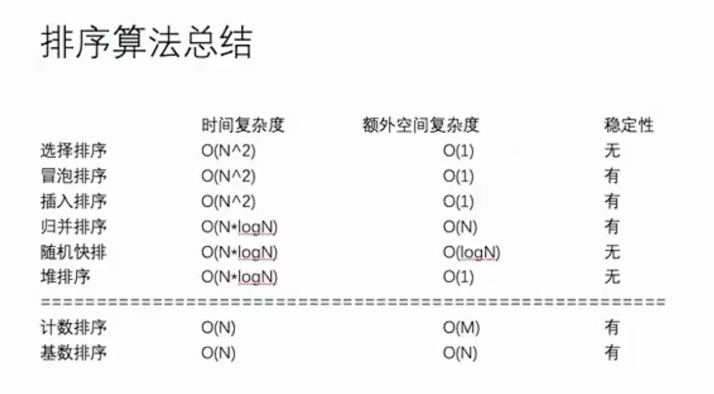

# 算法

[toc]

------


**100题**

https://atfwus.blog.csdn.net/article/details/106193067?spm=1001.2101.3001.6650.1&utm_medium=distribute.pc_relevant.none-task-blog-2%7Edefault%7ECTRLIST%7ERate-1-106193067-blog-78081784.pc_relevant_default&depth_1-utm_source=distribute.pc_relevant.none-task-blog-2%7Edefault%7ECTRLIST%7ERate-1-106193067-blog-78081784.pc_relevant_default&utm_relevant_index=2

## 常用算法


**动态规划算法**

https://www.cxyxiaowu.com/8536.html

**递归**

https://mp.weixin.qq.com/s?__biz=MzI5MTU1MzM3MQ==&mid=2247483813&idx=1&sn=423c8804cd708b8892763a41cfcc8886&scene=21#wechat_redirect

**最短路径DIJSKT** **/fpoyd**

弗洛伊德算法(Floyd)计算图中各个顶点之间的最短路径
迪杰斯特拉算法用于计算图中某一个顶点到其他顶点的最短路径。
弗洛伊德算法VS 迪杰斯特拉算法：迪杰斯特拉算法通过选定的被访问顶点，求出从出发访问顶点到其他顶点的最短路径；弗洛伊德算法中每一个顶点都是出发访问点，所以需要将每一个顶点看做被访问顶点，求出从每一个顶点到其他顶点的最短路径。

floyd：

https://blog.csdn.net/qq_34842671/article/details/90637502?spm=1001.2101.3001.6650.12&utm_medium=distribute.pc_relevant.none-task-blog-2%7Edefault%7ECTRLIST%7ERate-12-90637502-blog-106981402.pc_relevant_default&depth_1-utm_source=distribute.pc_relevant.none-task-blog-2%7Edefault%7ECTRLIST%7ERate-12-90637502-blog-106981402.pc_relevant_default&utm_relevant_index=15

dijskt：

https://blog.csdn.net/qq_35644234/article/details/60870719?spm=1001.2101.3001.6650.4&utm_medium=distribute.pc_relevant.none-task-blog-2%7Edefault%7ECTRLIST%7ERate-4-60870719-blog-84281300.pc_relevant_multi_platform_whitelistv4&depth_1-utm_source=distribute.pc_relevant.none-task-blog-2%7Edefault%7ECTRLIST%7ERate-4-60870719-blog-84281300.pc_relevant_multi_platform_whitelistv4&utm_relevant_index=9

https://blog.csdn.net/lbperfect123/article/details/84281300?spm=1001.2101.3001.6650.1&utm_medium=distribute.pc_relevant.none-task-blog-2%7Edefault%7ECTRLIST%7ERate-1-84281300-blog-50421243.pc_relevant_multi_platform_whitelistv3&depth_1-utm_source=distribute.pc_relevant.none-task-blog-2%7Edefault%7ECTRLIST%7ERate-1-84281300-blog-50421243.pc_relevant_multi_platform_whitelistv3&utm_relevant_index=2

**分治算法**

https://blog.csdn.net/xushiyu1996818/article/details/90905256?spm=1001.2101.3001.6650.13&utm_medium=distribute.pc_relevant.none-task-blog-2%7Edefault%7EBlogCommendFromBaidu%7ERate-13-90905256-blog-107201275.pc_relevant_multi_platform_featuressortv2dupreplace&depth_1-utm_source=distribute.pc_relevant.none-task-blog-2%7Edefault%7EBlogCommendFromBaidu%7ERate-13-90905256-blog-107201275.pc_relevant_multi_platform_featuressortv2dupreplace&utm_relevant_index=16

**贪婪算法**

https://blog.csdn.net/qq_32400847/article/details/51336300?spm=1001.2101.3001.6650.2&utm_medium=distribute.pc_relevant.none-task-blog-2%7Edefault%7ECTRLIST%7ERate-2-51336300-blog-124636914.pc_relevant_multi_platform_whitelistv4&depth_1-utm_source=distribute.pc_relevant.none-task-blog-2%7Edefault%7ECTRLIST%7ERate-2-51336300-blog-124636914.pc_relevant_multi_platform_whitelistv4&utm_relevant_index=5

**最小生成树** **kruska**

https://blog.csdn.net/qq_41754350/article/details/81460643?spm=1001.2101.3001.6661.1&utm_medium=distribute.pc_relevant_t0.none-task-blog-2%7Edefault%7ECTRLIST%7ERate-1-81460643-blog-113885647.pc_relevant_multi_platform_featuressortv2dupreplace&depth_1-utm_source=distribute.pc_relevant_t0.none-task-blog-2%7Edefault%7ECTRLIST%7ERate-1-81460643-blog-113885647.pc_relevant_multi_platform_featuressortv2dupreplace&utm_relevant_index=1

prim

https://pursuit.blog.csdn.net/article/details/107927858?spm=1001.2101.3001.6650.11&utm_medium=distribute.pc_relevant.none-task-blog-2%7Edefault%7ECTRLIST%7ERate-11-107927858-blog-121597780.pc_relevant_multi_platform_featuressortv2dupreplace&depth_1-utm_source=distribute.pc_relevant.none-task-blog-2%7Edefault%7ECTRLIST%7ERate-11-107927858-blog-121597780.pc_relevant_multi_platform_featuressortv2dupreplace&utm_relevant_index=15

**滑动窗口**

https://blog.csdn.net/Dby_freedom/article/details/89066140?spm=1001.2101.3001.6661.1&utm_medium=distribute.pc_relevant_t0.none-task-blog-2%7Edefault%7ECTRLIST%7ERate-1-89066140-blog-124369425.pc_relevant_multi_platform_whitelistv4eslandingctr&depth_1-utm_source=distribute.pc_relevant_t0.none-task-blog-2%7Edefault%7ECTRLIST%7ERate-1-89066140-blog-124369425.pc_relevant_multi_platform_whitelistv4eslandingctr&utm_relevant_index=1

**KMP**

https://blog.csdn.net/v_JULY_v/article/details/7041827?spm=1001.2101.3001.6650.2&utm_medium=distribute.pc_relevant.none-task-blog-2%7Edefault%7ECTRLIST%7ERate-2-7041827-blog-88698736.pc_relevant_multi_platform_whitelistv4&depth_1-utm_source=distribute.pc_relevant.none-task-blog-2%7Edefault%7ECTRLIST%7ERate-2-7041827-blog-88698736.pc_relevant_multi_platform_whitelistv4&utm_relevant_index=5

-----------------------------------------------------------------------------------------------------------------------------------------------------------

**求解** **算法题的要领：**

- **首先要根据题意，先根据前几个数进行计算，也就是找规律**
- **然后根据前几个数的计算将规律设计成公式**
- **分析规律，看是属于哪一类算法，要用什么算法进行解决：递归、动态规划、贪婪算法、最小路径、最小生成树、分治算法等**
- **找到用什么算法进行解决之后，要根据规律写出伪代码，也就是说明语句，然后再将伪代码写成真代码**

------

## 链表

#### 单链表的反转

```js
//单链表的反转：遍历链表，然后放入到一个数组中，然后再一点点放出来:坏办法
class MyNode{
    constructor(value){
        this.value = value;
        this.nextNode = null;
    }
    setNextNode(nextNode){
        this.nextNode = nextNode;
    }
}
var head = new MyNode(0);
var node1 = new MyNode(1);
var node2 = new MyNode(2);
var node3 = new MyNode(3);
var node4 = new MyNode(4);
var node5 = new MyNode(5);
var node6 = new MyNode(6);
head.setNextNode(node1);
node1.setNextNode(node2);
node2.setNextNode(node3);
node3.setNextNode(node4);
node4.setNextNode(node5);
node5.setNextNode(node6);
reverseNode(head);
console.log(head);
function reverseNode(head) {
  //先指向一个头节点，相当于一个指针
    var temp = head;
  //新建一个存放链表的数组
    var nodeArr = [];
  //如果当前节点的下一个节点不为空，则将下一个节点压栈，并将指针后移，直到下一个节点为空
    while(temp.nextNode!=null){
        nodeArr.push(temp.nextNode);
        temp = temp.nextNode;
    }
  //全部遍历完毕之后，就开始一个一个的出栈
    var reverseTemp = head;
    for (let i = 0; i < nodeArr.length; i++) {
        reverseTemp.nextNode = nodeArr.pop();
        reverseTemp = reverseTemp.nextNode;
    }
}
```


## 排序算法

排序算法可以分为两大类:

基于比较的排序:冒泡排序 插入排序 选择排序 归并排序 快速排序 堆排序 希尔排序

不基于比较的的排序(容器的思想): 桶排序 计数排序 

#### 1: 冒泡排序

略

#### 2: 选择排序

*选择选择，选择其中一个与前面的项进行交换。*

算法步骤：

- 遍历整个数组，找到最小的一个，然后将最小的这个与数组第一项进行交换。
- 遍历arr[1]~arr[n-1]，找到最小的一个，与数组第二项进行交换。
- ···
- 直到遍历到最后一个，算法终止。

```js
//2-选择排序的基本思想：
//先遍历整个数组，然后将最小的放在最前面，然后重复这个步骤，总共需要进行arr.length-1次
var arr = [7,8,5,4,3,4,0,9,10,8];
selectSort(arr);
console.log(arr);
function selectSort(arr) {
    for (let j = 0; j < arr.length; j++) {
        var min = arr[j];
        var minIndex = j;
        for (let i = j; i < arr.length; i++) {
            if(min>arr[i]){
                min = arr[i];
                minIndex = i;
                }
        }
        var tem = arr[j];
        arr[j] = min; 
        arr[minIndex] = tem;
    }
}
```

#### 3: 插入排序

*将元素插入到合适的位置的一种排序方法*

算法步骤：

- 把n个待排序的数分成两部分，一部分为有序表，一部分为无序表
- 每次排序时都从无序表中取第一个，然后插入到有序表中

```js
var arr = [8,4,5,6,3,9,0,1,7,2,4,15,13];
function insertSort(arr) {
    //mid=1表示我从arr[1]处将两部分分开-一部分有序表，一部分无序表
    var mid = 1;
    //对整个表进行遍历
    for (let i = 0; i < arr.length+2; i++) {
        //该值为无序表的第一个值
        var val = arr[mid];
        //我们从无序表的第一个值进行往后遍历，因为无序表的第一个在这番轮回时已经进入有序表了
        for (let j = mid; j >= 0; j--) {
            //如果无序表的第一个值比有序表当前索引小/相等
                if(val<=arr[j]){
                    //如果是到有序表的第一个了仍旧比它小
                    if(j==0){
                        //则将arr0设成val
                        arr[j] = val;
                    }
                    //如果不是有序表的第一个，且val的值比有序表当前的值小/相等，则将有序表的值进行前移
                    else{
                    arr[j] = arr[j-1];
                }
            }
                //如果val比有序表的当前值大，则直接赋值，因为它已经前移了
                else{
                    arr[j+1] = val;
                    mid++;
                    break;
                }
        } 
    }
}
```


#### 4: 希尔排序

*希尔，插入的优化*

算法步骤：

-  首先，按照数组的长度对整个数组进行分组，第一次分组为length/2，假设length=10，则分成了5组

  （注意：分成的5组，每一组两个，每组步长为5）

- 

- 对该5组分别进行插入排序（也就是将每一组分成两部分，一部分有序表一部分无序表，每次从无序表中取，插入到有序表中），排序完毕之后再次及逆行分组，分成5/2 = 2组

- 

- 然后对这两组再进行插入排序，直到分组为1，再进行一次分组排序即可。

```js
function shellSort(arr) {
    //首先，先进行分组   
    for (let gap = parseInt(arr.length/2); gap > 0; gap = parseInt(gap/2)) {
        //然后，针对从每一个组里面开始，
        for (let i = gap; i < arr.length; i++) {
            var j = i;
            //将当前值暂时存储
            var temp = arr[j];
            //如果说小组的前一个值比当前值大，我需要将当前值变为前一个值，一步步进行移位
            if(arr[j-gap]>temp){
                //j-gap>=0是为了不越界，然后比较前一个值是否还大于当前值，如果大于，则移位
                while(j-gap>=0&&arr[j-gap]>temp){
                    //当前值改为前一个值
                    arr[j] = arr[j-gap];
                    j = j - gap;
                }
                //当不再大于的时候，就将temp的值付给arr[j]
                arr[j] = temp;
            }
        }
    }
}
```

#### 5: 快速排序-递归

*左右两边一直进行递归快排，比较快*

步骤：

- 首先先随机取数组中的一个数，将比该数小的放在左侧，比该数大的放在右侧
- 在左侧再随机取一个值，重复上述步骤，在右侧随机取一个值，重复上述步骤
- 直到数组内所有元素已排序停止

伪代码：

function  快排（）{

​	判断是否达到停止条件？

​	取一个随机数；

​	将比该数小的放左侧，比该数大的放右侧。

​	左侧进行快排（）；

​	右侧进行快排（）；

}

```js
quickSort(arr,0,arr.length-1);
function quickSort(arr,left,right) {
    //存储下当前的最左侧的值和最右侧的下标
    var thisLeft = left;
    var thisRight = right;
    //存储下最左侧的值为基本值
    var baseValue = arr[left];
    //如果左侧的索引值大于等于了右侧的索引值，则返回
    if(thisRight<=thisLeft){
        return ;
    }
    //开始步进
    while(left<right){
        //当左侧索引小于右侧索引且右侧的值大于等于基本值，则右侧索引递减
        while(arr[right]>=baseValue&&left<right){
            right--;
        }
        //当右侧有一个值小于了基准值，则保存其位置，并且找左侧，当左侧索引值小于等于基准值时，则递增
        while(arr[left]<=baseValue&&left<right){
            left++;
        }
        //当两侧都找到了对应的不匹配的值，则开始互换
        if(left<right){
        var temp = arr[left];
        arr[left] = arr[right];
        arr[right] = temp;
        }
    }
    //当左侧索引不再小于右侧索引时，则将基准值放在left处
    arr[thisLeft] = arr[left];
    arr[left] = baseValue;
    //递归
    quickSort(arr,thisLeft,right-1);
    quickSort(arr,right+1,thisRight);
}
```

#### 6: 归并排序-递归

*归并，分治算法经典代表 --- 归反并 分反治*

步骤：

- 首先进行分，左右进行分一直分到不能再分为止
- 然后再进行治，进行合并，合并即将对应的值按组一个一个的按顺序放到新的数组里面
- 直到治为一整个数组

伪代码思路：

function 归并（）{

​	左侧分:归并（left）；

​	右侧分:归并（right）；

​	合并治:合并（）；

}

代码：

```js
//归并排序思想：
//归并排序是将整个arr先向下分，分到最小只有一个元素时再进行合并
//分的时候就是根据left、mid、right进行递归分
//递归到最后一轮开始从最后一轮开始合并
//合并时根据要合并的两部分，左右每次轮回一个元素比较，小的放到新arr里面，然后小的元素原先在的部分下标索引+1
//当两侧有一侧遍历完后，将剩余部分放入新arr，再将新arr的前right-left个元素给予arr[left-right];

var arr = [8,4,5,7,1,3,6,2];
var tempArr = [];
mergeSort(arr,0,arr.length-1,tempArr);
console.log(arr);
function mergeSort(arr,left,right,tempArr) {
    if(left<right){
        var mid = parseInt((left+right)/2);
        //向左分解
        mergeSort(arr,left,mid,tempArr);
        //向右分解
        mergeSort(arr,mid+1,right,tempArr);
        //合并
        merage(arr,left,right,tempArr);
    }
}
function merage(arr,left,right,tempArr) {
    var gap = right + left;
    var mid = parseInt(gap/2);
    //l代表左半部分的开始
    var l = left;
    //r代表右半部分的开始
    var r = mid + 1;
    tempArr = [];
    //当l未到达左半部分的终点和r未到达右半部分终点时
    while(l<=mid&&r<=right){
        //如果左小于右，则放到新数组中，l前移一格
        if(arr[l]<=arr[r]){
            tempArr.push(arr[l]);
            l++;            
        }
        //如果右小于左，则放入新数组中，r前移一格
        else{
            tempArr.push(arr[r]);
            r++;
        }
    }
    //左右任何一部分移动完成之后则while终止，对未完成的部分进行填充
    if(l<=mid){
        for (let i = l; i <= mid; i++) {
            tempArr.push(arr[i]);
        }
    }
    if(r<=right){
        for (let i = r; i <= right; i++) {
            tempArr.push(arr[i]);
        }
    }
    //填充完之后根据当前迭代的左右边界进行赋值
    for (let i = left; i <= right; i++) {
        arr[i] = tempArr[i-left];
    }
}

```

#### 7: 基数排序-桶排序

基数排序是效率高的稳定性排序法

步骤：就是将arr里面的数先统一成统一长度，然后根据个、十、百、千位进行挨个的放入桶中，然后挨个取出

```js
//桶排序原理：（基数排序原理 ）：
//就是将arr里面的数先统一成统一长度，然后根据个、十、百、千位进行挨个的放入桶中，然后挨个取出

var arr = [53,3,542,748,14,214];
console.log(radixSort(arr));
function radixSort(arr) {
    //先创建十个桶，对应0～9
    var radix = new Array(10);
    for (let i = 0; i < 10; i++) {
        radix[i] = [];
    }
    //对每一个arr里面的项，进行个位十位百位分别排序
    //先找到最大的数
    var max = arr[0];
    for (let i = 0; i < arr.length; i++) {
        if(arr[i]>max){
            max = arr[i];
        }
    }
    //需要除以的位数
    var gap = 0.1;
    var times = max;
    while(times!=0){
        times = parseInt(times/10);
        gap = gap * 10;
    //对应的位数的值进行桶里面的存放
        for (let j = 0; j < arr.length; j++) {
            var t = parseInt(arr[j]/gap)%10;
            radix[t].push(arr[j]); 
    }
    var arr = [];
    for (let i = 0; i < 10; i++) {
        var length = radix[i].length;
        for(let j = 0; j < length; j++){
            arr.push(radix[i].shift());
        }      
    }
}
return arr;
}
```

#### 8: 堆排序-二叉树

堆排序是根据二叉树的特性生成的。但是堆排序是对数组进行排序，因此需要用到顺序存储二叉树的内容。

堆排序需要从左至右，从下之上的进行

如果需要升序，即大顶堆，步骤：

- 先找到最后一个非叶子节点，其index = arr.length/2(向下取整) - 1
- 然后看该非叶子节点的左子节点(index*2+1)和右子节点(index*2-1)哪个比自身大，选最大的一个，彼此交换
- 交换完成之后找第二个非叶子节点，其index = arr.length/2(向下取整) - 2
- 对该非叶子节点进行同样的操作，交换完之后可能会导致子根结构混乱，则重新继续调整，且标记调整次数
- 如果调整次数为0，则表明已经是一个大顶堆，则将数组第一个元素与最后一个元素呼唤（将堆顶元素与末尾元素进行交换），并将最后一个元素去除，即arr.length-1
- 重复上述步骤，直到啊arr.length = 1


```js
//堆排序--一般升序采用的是大顶堆，降序采用的是小顶堆
//步骤：
//先从左至右，从底往上的进行
// 如果是升序，大顶堆
//-1- 先找最后一个非叶子节点开始：index = arr.length/2(向下取整) - 1
//-2- 然后看该非叶子节点的左子节点(index*2+1)和右子节点(index*2-1)哪个比自身大，且选最大的一个，彼此交换
//-3- 交换完之后找第二个非叶子节点：index = arr.length/2 - 2
//-4- 对该非叶子节点进行-2-同样的操作，交换完之后导致子根结构混乱，则重新继续调整，且标记调整次数
//-5- 如果调整次数为0，则表明已经是一个大顶堆，将堆顶元素与末尾元素进行交换，并去除末尾元素，即arr.length-1
//-6- 继续1-5步，直到arr.length = 1

//采用升序-大顶堆
var arr = [4,6,8,5,9];
var temp1;
var temp2;
var temp3;
var index;
//定义每一次需要选择的子节点，
var step = 1;
//定义每次进行交换次数
var changeTimes = 1;
//定义数组长度
var arrLength = arr.length;
//当数组长度不为1时，即最终交换还未结束
while(arrLength!=1){
    changeTimes = 1;
//当交换次数不为0时，证明还可能有交换可能
while(changeTimes!=0){
    changeTimes = 0;
    step = 1;
//遍历循环各个非子叶节点
while(Math.floor(arrLength/2)-step>=0){
    //非子叶节点对应的数组的索引
    index = Math.floor(arrLength/2)-step;
    //判断是否越界，即左子节点是否存在
    index*2+1<arrLength ? temp1 = index*2+1:temp1 = -Infinity;
    //判断右子节点是否存在
    index*2+2<arrLength ? temp2 = index*2+2:temp2 = -Infinity;
    //如果说左子节点不存在，则需要比较的只有右子节点了：else则只有左子节点了
    if(temp1==-Infinity){temp3 = temp2}
    else if(temp2==-Infinity){temp3 = temp1}
    else{
        //左右都存在，则挑最大的进行比较
        arr[temp1]<arr[temp2] ? temp3 = temp2 : temp3 = temp1;
    }
    //如果当前非叶子节点没有其子节点大，则进行交换
    if(arr[temp3]>arr[index]){
        var mid = arr[index];
        arr[index] = arr[temp3];
        arr[temp3] = mid;
        changeTimes++;
    }
    //进行下一个子节点的轮回
    step++;
}
}
//没有再发生交换，则arr第一个数和arr最后一个数交换，且去除最后一个数的存在
var te = arr[0];
arr[0] = arr[arrLength-1];
arr[arrLength-1] = te;
arrLength--;
}
console.log(arr);
```

#### 9: 加强堆


#### 总结:

**排序稳定性**:什么是排序稳定性?排序稳定性是指假设你有一个数组[1,1,2,2,3,3,4,4],,其中里面有相同的值的排序,排序稳定性就是指原本在第一个位置的1排序完之后还能否在第一个位置.稳定性主要是针对对象而言的.例如针对对象类型中的Id进行排序,而相同id的不同对象是不一样的.另外,稳定排序的稳定性会传承下来,比如一个学生,有班级和年龄.先对年龄进行排序,再对班级进行排序的话,用稳定的排序算法进行排序,那么先前的年龄的排序结果会在班级排序中传承下来.




## 查找算法

#### 1、二分查找--递归

*二分查找就是将整个数组对半分，每次都缩短一半的查找*

步骤：首先找到数组的中值，然后将要比较的值与中值进行比较，如果小于，则在左侧查找，如果大于，则在右侧进行查找

伪代码：

function 二分查找（）{

​	if（已经查找到最后一个值）{

​		未找到。

​	}

​	if（查找的值<中值）{

​		二分查找（左）；

​	}	

​	if（查找的值>中值）{

​		二分查找（右）；

​	}

​	else{

​		已找到。

​	}

}

代码：

```js
//二分查找算法的思路:
//-1- 首先需要给定的数是一个排序好的数,然后得到arr的中间数,然后让需要被查找到的数与中间数比较
//-2- 如果比中间数小,则往左递归,如果比中间数大,则向右递归
//-3- 找到该数字时结束,没找到 当左>右时结束
function binarySearch(arr,left,right,searchValue) {
    if(left>right){
        return -1;
    }
    mid = Math.floor((left + right)/2);
    if(searchValue<arr[mid]){
       var re = binarySearch(arr,left,mid-1,searchValue);
       if(re){return re};
    }
    if(searchValue>arr[mid]){
       var re = binarySearch(arr,mid+1,right,searchValue);
       if(re){return re};
    }
    if(searchValue==arr[mid]){
        return mid;
    }
}
var arr = [1,8,10,89,1000,1234];
var re = binarySearch(arr,0,arr.length-1,99);
console.log(re);
```

#### 2、插值查找

​	插值查找与二分查找类似，只是mid的计算公式换了：

​	mid = left + parseInt((searchValue - arr[left])/(arr[right] - arr[left]))*(right - left);

```js
//插值查找的算法思路
//插值查找算法类似于二分查找,不同的是每次的mid是自适应的
//mid公式为:mid = left + (searchValue - arr[left])/(arr[right] - arr[left])*(right - left);

function InsertSearch(arr,left,right,searchValue) {
    if(left>right||searchValue<arr[0]||searchValue>arr[arr.length-1]){
        return -1;
    }
    var mid = left + parseInt((searchValue - arr[left])/(arr[right] - arr[left]))*(right - left);
    if(searchValue>arr[mid]){
        var re = InsertSearch(arr,mid+1,right,searchValue);
        if(re){return re};
     }
    if(searchValue<arr[mid]){
       var re = InsertSearch(arr,left,mid-1,searchValue);
       if(re){return re};
    }
    if(searchValue==arr[mid]){
        return mid;
    }
}
var arr = [1,8,10,89,1000,1234];
var re = InsertSearch(arr,0,arr.length-1,99);
console.log(re);
```

#### 3、斐波那契查找-递归

斐波那契查找需要使用到斐波那契的特殊属性-0.618

步骤：

- 首先，需要产生一个斐波那契数列
- 初始化的斐波那契数列的最后一位的值要刚好比数组的最后一位大一下
- 然后根据斐波那契产生的最后一位的值对原数组进行填充
- 因为fb(n) = fb(n-1)+fb(n-2)，且此时数组长度为fb(n)，因此可以将数组分成fb(n-1)和fb(n-2)两部分，一般左侧比右侧大
- 将需要查找的数与两部分的中间比较，小于则说明在左侧，大于则说明在右侧
- 如果小于在左侧，因为fb(n-1) = fb(n-2)+fb(n-3)，所以将左侧再次分成两部分，并重新比较
- 如果大于在右侧，因为fb(n-2) = fb(n-3)+fb(n-4)，所以将右侧再次分成两部分，并重新比较


```js
//斐波那契查找本质上也是改变mid的值进行查找的
//斐波那契查找算法的原理：
//-1- 首先产生一个斐波那契数列
//-2- 假设共有10个数，下标从0-9,则初始化fib数列，其中fib数列的最后一位的值要刚好比arr.length-1大
// 例如 fib = [1,1,2,3,5,8,13];
// 这个时候要对arr进行填充，填充到fib[-1]的长度：arr=[2,3,7,14,22,33,55,75,89,123,123,123,123];
// 因为13 = 5+8，且这个时候arr共有13个数，n = fibarr.length;所以将arr分成左右两部分，左侧8个，右侧5个
//-3- 将需要查找的数与arr[8-1]进行比较，mid = 8-1 如果findval<arr[8-1]:
//    则将left = 0，right = mid-1，这个时候还有8个数，n = n-1将这8个数再分成3+5,左5右3继续同上
//    若findvalue>arr[8-1],则对5进行分，n = n-2 ,对5进行拆分，拆分成3+2
var arr = [2,3,7,14,22,33,55,75,89,123];
var fib = fibonacci();
var fibArr = [];
for (let i = 0; i < 2*arr.length; i++) {
    var x = fib.next().value;
    fibArr.push(x);
    if(x>=arr.length){
        break;
    }
}
while(arr.length<fibArr[fibArr.length-1]){
    arr.push(arr[arr.length-1]);
}

console.log(fibnacciSearch(fibArr,arr,0,arr.length-1,123,fibArr.length-1));

function fibnacciSearch(fibArr,arr,left,right,findValue,n) {
    //如果n=0，说明斐波那契数列已经遍历完了还没找到，结束
    if(n==0){
        return -1;
    }
    //因为斐波那契最小数是1，所以mid最小是1，找不到两边，所以作限制
    if(findValue==arr[0]){
        return 0;
    }
    if(findValue==arr[arr.length-1]){
        return arr.length-1;
    }
    var mid = fibArr[n-1];
    //如果find<mid，（注意是left+mid），则左侧继续遍历，n = n - 1;因为左侧占大头
    if(findValue<arr[left+mid]){
        var re = fibnacciSearch(fibArr,arr,left,mid-1,findValue,n-1);
        if(re){return re};
    }    
    //反之，则右侧遍历，n = n - 2;因为右侧占小头
    if(findValue>arr[left+mid]){
        var re = fibnacciSearch(fibArr,arr,mid+1,right,findValue,n-2);
        if(re){return re};
    }
    if(findValue==arr[mid]){
        return mid;
    }
}

//产生斐波那契数列--这里用generator函数来实现
function* fibonacci() {
    var f1 = 1;
    var f2 = 1;
    yield(f1);
    yield(f2);
    while(1){
        yield(f1+f2);
        f1 = f1 + f2;
        f2 = f1 - f2;
    }
}
```


## 二叉树


#### 二叉树的遍历

1# 前序遍历：先输出父节点，再遍历左子树和右子树

2# 中序遍历：先遍历左子树，再输出父节点，再遍历由子树

3# 后序遍历：先遍历左子树，再遍历右子树，再输出父节点

同理二叉树查找

```js
//定义节点类
class MyNode{

    constructor(no,name){
        this.no = no;
        this.name = name;
    }
    //设置左节点
    setLeftNode(node) {
        this.leftNode = node;
    }
    //设置右节点
    setRightNode(node){
        this.rightNode = node;
    }
    //设置该节点已被遍历
    setHasRead(){
        this.hasRead = true;
    }
    sayMyName(){
        console.log("no:",this.no,",name:",this.name);
    }
    //递归实现前序遍历
    preOrderDG(){
        this.sayMyName();
        if(this.leftNode!=null){
            this.leftNode.preOrderDG();
        }
        if(this.rightNode!=null){
            this.rightNode.preOrderDG();
        }
    }
    //递归实现前序查找
    //先判断当前节点是否是要查找的节点，是则返回当前节点，如果不等，则左递归查找，然后右递归查找
    preSearchDG(searchNode){
        if(this.name==searchNode.name){
            return this.no;
        }
        if(this.leftNode!=null){
           var re = this.leftNode.preSearchDG(searchNode);
           if(re){return re};
        }
        if(this.rightNode!=null){
            var re = this.rightNode.preSearchDG(searchNode);
            if(re){return re};
        }
    }
    //递归实现中序查找
    midSearchDG(searchNode){
        if(this.leftNode!=null){
           var re = this.leftNode.preSearchDG(searchNode);
           if(re){return re};
        }
        if(this.name==searchNode.name){
            return this.no;
        }
        if(this.rightNode!=null){
            var re = this.rightNode.preSearchDG(searchNode);
            if(re){return re};
        }
    }
    //递归实现后序查找
    afterSearchDG(searchNode){
        if(this.leftNode!=null){
            var re = this.leftNode.preSearchDG(searchNode);
            if(re){return re};
         }
         if(this.rightNode!=null){
             var re = this.rightNode.preSearchDG(searchNode);
             if(re){return re};
         }
         if(this.name==searchNode.name){
            return this.no;
        }
    }
    //删除节点或节点子树
    deleteNode(de){
        if(this.leftNode==de){
            this.leftNode = null;
            return 1;
        }
        else if(this.rightNode==de){
            this.rightNode = null;
            return 1;
        }
        else{
            if(this.leftNode!=null){
               var re = this.leftNode.deleteNode(de);
               if(re){return re};
            }
            if(this.rightNode!=null){
                var re = this.rightNode.deleteNode(de);
                if(re){return re};
            }
        }

    }
  }
//定义二叉树类
class BinaryTree{
    constructor(node){
        this.root = node;
    }

    //遍历方法
    //前序遍历：先输出当前节点,如果左子节点不为空，则递归前序遍历；如果右子节点不为空，则递归前序遍历
    preOrder(){
        //表示现在的node节点
        var nowNode;
        //用来保存经过的Node
        var saveNode = [];
        nowNode = this.root;
        nowNode.sayMyName();
        saveNode.unshift(nowNode);
        while(1){
        //如果左子节点不为空，且未被遍历过，则输入并继续
        if(nowNode.leftNode!=null&&nowNode.leftNode.hasRead!=true){
            //将该节点纳入存储库中
            saveNode.unshift(nowNode);
            nowNode = nowNode.leftNode;
            //设置该节点已被读
            nowNode.setHasRead();
            nowNode.sayMyName();
        }
        //左子节点为空了，则查看右子节点是否为空，若不为空，且未被遍历过
        else if(nowNode.rightNode!=null&&nowNode.rightNode.hasRead!=true){
            saveNode.unshift(nowNode);
            nowNode = nowNode.rightNode;
            nowNode.setHasRead();
            nowNode.sayMyName();
        }
        //左右节点都为空，到头了
        else{
            nowNode = saveNode.shift();
        }
        if(saveNode.length==0){
            break;
        }

    }
    }
    //中序遍历：先遍历左子树，遍历到头再输出当前节点，再遍历右子树
    midOrder(){
        //表示现在的node节点
        var nowNode;
        //用来保存经过的Node
        var saveNode = [];
        nowNode = this.root;
        //表示该节点已被读
        nowNode.setHasRead();
        while(1){
        //如果左子节点不为空，且未被遍历过，则输入并继续
        if(nowNode.leftNode!=null&&nowNode.leftNode.hasRead!=true){
            //将该节点纳入存储库中
            saveNode.unshift(nowNode);
            nowNode = nowNode.leftNode;
            //设置该节点已被读
            nowNode.setHasRead();
        }
        //左子节点为空了，则查看右子节点是否为空，若不为空，且未被遍历过
        else{
            //左子节点为空，呐喊
            nowNode.sayMyName();
        if(nowNode.rightNode!=null&&nowNode.rightNode.hasRead!=true){
            //到了右子节点就不必再纳入存储库中了，否则就多了
            nowNode = nowNode.rightNode;
            nowNode.setHasRead();
        }
        //左右节点都为空，到头了
        else{
            if(saveNode.length==0){
                break;
            }
            nowNode = saveNode.shift();
        }
    }
    }
        
    }
    //后序遍历：先遍历左子树，再遍历右子树，最后输出父节点
    afterOrder(){
         //表示现在的node节点
         var nowNode;
         //用来保存经过的Node
         var saveNode = [];
         nowNode = this.root;
         //表示该节点已被读
         nowNode.setHasRead();
         while(1){
         //如果左子节点不为空，且未被遍历过，则输入并继续
         if(nowNode.leftNode!=null&&nowNode.leftNode.hasRead!=true){
             //将该节点纳入存储库中
             saveNode.unshift(nowNode);
             nowNode = nowNode.leftNode;
             //设置该节点已被读
             nowNode.setHasRead();
         }
         //左子节点为空了，则查看右子节点是否为空，若不为空，且未被遍历过
         else if(nowNode.rightNode!=null&&nowNode.rightNode.hasRead!=true){
             saveNode.unshift(nowNode);
             nowNode = nowNode.rightNode;
             nowNode.setHasRead();
         }
         else{
             nowNode.sayMyName();
         //左右节点都为空，到头了
             if(saveNode.length==0){
                 break;
             }
             nowNode = saveNode.shift();
         }
     }   
     }
}
var node1 = new MyNode(1,'SJ');
var node2 = new MyNode(2,'WY');
var node3 = new MyNode(3,'LJY');
var node4 = new MyNode(4,'LC');
var node5 = new MyNode(5,'GS');
//手动创建二叉树
node1.setLeftNode(node2);
node1.setRightNode(node3);
node3.setLeftNode(node5);
node3.setRightNode(node4);
//二叉树对象
var bt = new BinaryTree(node1);

//内容1--遍历--------------------------------

//前序遍历迭代
// bt.preOrder();
//中序遍历迭代
// bt.midOrder();
//后序遍历迭代
// bt.afterOrder();
//前序递归
// node1.preOrderDG();

//内容2--查找--------------------------------

//前序查找递归
// console.log(node1.preSearchDG(node4)); 
//中序查找递归
// console.log(node1.midSearchDG(node5));
//后序查找递归
// console.log(node1.afterSearchDG(node3));

//内容3--删除节点子树--------------------------------
// node1.deleteNode(node3);
// node1.preOrderDG();
```

#### 二叉树的广度优先与深度优先

二叉树的广度优先就是先优先搜索当前节点下的左子节点和右子节点并输出

二叉树的深度优先是先一直向左子节点搜索，搜索到null，再输出，再从右子节点搜索到null，再输出右子节点


```js
//定义节点类
class MyNode{

    constructor(no){
        this.no = no;
    }
    //设置左节点
    setLeftNode(node) {
        this.leftNode = node;
    }
    //设置右节点
    setRightNode(node){
        this.rightNode = node;
    }
    sayMyName(){
        console.log("no:",this.no);
    }
}

var roots = new MyNode(1);
var node2 = new MyNode(2);
var node3 = new MyNode(3);
var node4 = new MyNode(4);
var node5 = new MyNode(5);
var node6 = new MyNode(6);
var node7 = new MyNode(7);
roots.setLeftNode(node2);
roots.setRightNode(node3);
node2.setLeftNode(node4);
node2.setRightNode(node5);
node3.setLeftNode(node6);
node3.setRightNode(node7);
var re = BinaryTreeBFS(roots);
console.log(re);

var re = BinaryTreeDFS(roots);
console.log(re);
//二叉树广度优先搜索配合栈的先入先出原则非常好用
function BinaryTreeBFS(roots) {
    var re = [];
    var treeArr = [roots];

    while(treeArr.length!=0){
        var target = treeArr.shift();
        re.push(target.no);
        if(target.leftNode!=null){
            treeArr.push(target.leftNode);
        }
        if(target.rightNode!=null){
            treeArr.push(target.rightNode);
        }
    }
    return re;


}
//二叉树的深度优先搜索
function BinaryTreeDFS(roots) {
    var re = [];
    var query = [roots];
    while(query.length!=0){
        var target = query.pop();
        re.push(target.no);
        if(target.rightNode!=null){
            query.push(target.rightNode);
        }
        if(target.leftNode!=null){
            query.push(target.leftNode);
        }
    }
    return re;
}
```


#### 顺序存储二叉树

给定一个数组，转换成二叉树的形式

特点：

- 顺序存储二叉树只考虑完全二叉树
- 第n个元素的左节点为2*n+1
- 第n个元素的右节点为2*n+2
- 第n个元素的父节点为(n-1)/2
- n表示二叉树中第几个元素

```js
//定义节点类
class MyNode{

    constructor(no){
        this.no = no;
    }
    //设置左节点
    setLeftNode(node) {
        this.leftNode = node;
    }
    //设置右节点
    setRightNode(node){
        this.rightNode = node;
    }
    sayMyName(){
        console.log("no:",this.no);
    }

    //二叉树存储成数组====一行一行的取出,广度优先
    saveAsArr(arr,root){
        var nowI = 0;
        arr.push(root);
        if(root.leftNode!=null){
            arr.push(root.leftNode);
            arr.push(root.rightNode);
        }
        while(nowI<arr.length-1){
        for (let i = nowI; i < arr.length; i++) {
             if(root==arr[i]){
                root = arr[i+1];
                 nowI = i + 1;
                 break;
             }
        }
        if(root.leftNode!=null){
            arr.push(root.leftNode);
            arr.push(root.rightNode);
        }
    }

    }
    //数组前序遍历
    arrPreOrder(index,arr){
        console.log(arr[index]);
        if(2*index + 1 < arr.length){
            this.arrPreOrder(2*index+1,arr);
        }
        if(2*index + 2 < arr.length){
            this.arrPreOrder(2*index + 2,arr);
        }
    }

    //数组存储成二叉树
    arrSaveAsBinTree(arr,index){
        if(index*2+1<arr.length){
            arr[index].setLeftNode(arr[index*2+1]);
            this.arrSaveAsBinTree(arr,index*2+1);
        }
        if(index*2+2<arr.length){
            arr[index].setRightNode(arr[index*2+2]);
            this.arrSaveAsBinTree(arr,index*2+2);
        }
    }

    //递归实现前序遍历
    preOrderDG(){
        this.sayMyName();
        if(this.leftNode!=null){
            this.leftNode.preOrderDG();
        }
        if(this.rightNode!=null){
            this.rightNode.preOrderDG();
        }
    }

}

var roots = new MyNode(1);
var node2 = new MyNode(2);
var node3 = new MyNode(3);
var node4 = new MyNode(4);
var node5 = new MyNode(5);
var node6 = new MyNode(6);
var node7 = new MyNode(7);
// roots.setLeftNode(node2);
// roots.setRightNode(node3);
// node2.setLeftNode(node4);
// node2.setRightNode(node5);
// node3.setLeftNode(node6);
// node3.setRightNode(node7);
//数组作为二叉树前序遍历
// arr = [1,2,3,4,5,6,7];
// roots.arrPreOrder(0,arr);
//将二叉树变为数组
// arr = [];
// roots.saveAsArr(arr,roots);
// console.log(arr);
//将数组变成二叉树
arr = [roots,node2,node3,node4,node5,node6,node7];
roots.arrSaveAsBinTree(arr,0);
roots.preOrderDG();

```


#### 线索化二叉树

当一个二叉树的某个节点没有左子节点或/且者右子节点，将其left/right指向前驱节点

线索化二叉树分为：

前序线索化：首先得到前序遍历的结果，根据前序遍历的结果，例如结果为 [8,3,11,14,6,5] ，8作为子节点无left，right，但是8在遍历结果中也无left，所以其right指向3；【需要标注该指向为指向前驱节点】

中序线索化：同上

后序线索化：同上

```js
//定义节点类
class MyNode{
    constructor(no){
        this.no = no;
        this.leftThread = false;
        this.rightThread = false;
    }
    //设置左节点
    setLeftNode(node) {
        this.leftNode = node;
    }
    //设置右节点
    setRightNode(node){
        this.rightNode = node;
    }
    sayMyName(){
        console.log("no:",this.no);
    }
    //中序线索化二叉树：就是先进行中序遍历，得到的节点，如果没有左子节点，则指向前一个，如果没有右子节点
    //则指向后一个
    threadBintryTree(arr){
        if(this.leftNode!=null){
            this.leftNode.threadBintryTree(arr);
        }
        arr.push(this);
        if(this.rightNode!=null){
            this.rightNode.threadBintryTree(arr);
        }
    }
    threadBintryTreeConnect(arr){
        for (let i = 0; i < arr.length; i++) {
            const e = arr[i];
            if(e.leftNode==null&&i>0){
                e.leftNode = arr[i-1];
                //说明该节点的左侧节点是通过线索化得来的
                e.leftThread = true;
            }
            if(e.rightNode==null&&i<arr.length-1){
                e.rightNode = arr[i+1];
                //说明该节点的右侧节点是线索化得来的
                e.rightThread = true;
            }
        }
    }
    //遍历线索化二叉树--中序
    midThreadOrder(){
        if(this.leftNode!=null&&!this.leftThread){
            this.leftNode.midThreadOrder();
        }
        this.sayMyName();
        if(this.rightNode!=null&&!this.rightThread){
            this.rightNode.midThreadOrder();
        }
    }

}
var roots = new MyNode(1);
var node2 = new MyNode(3);
var node3 = new MyNode(6);
var node4 = new MyNode(8);
var node5 = new MyNode(10);
var node6 = new MyNode(14);
roots.setLeftNode(node2);
roots.setRightNode(node3);
node2.setLeftNode(node4);
node2.setRightNode(node5);
node3.setLeftNode(node6);
//中序线索化
var arr = [];
roots.threadBintryTree(arr);
roots.threadBintryTreeConnect(arr);
//中序线索化遍历
roots.midThreadOrder();
```


