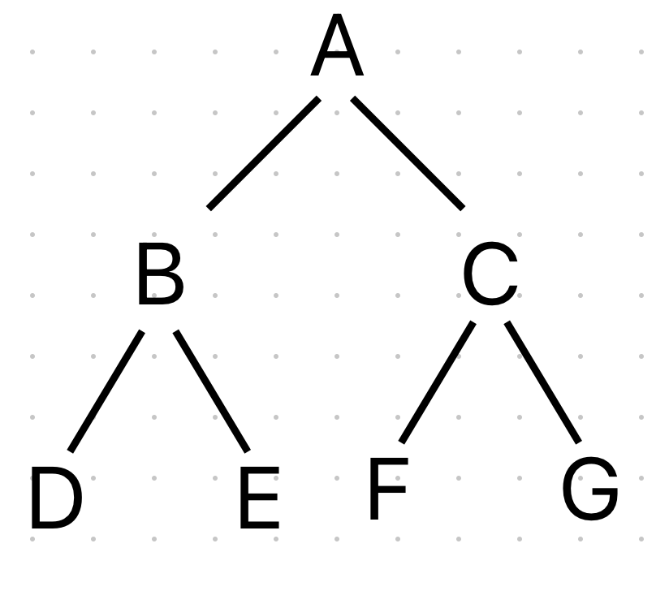
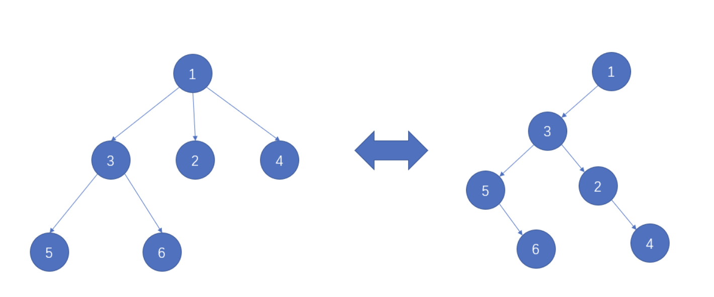

# 数据结构与算法#1


[toc]

------

## 对数器

> 自己设置的大样本随机测试，从而分析出自己的代码哪里错了。==> 这就是测试用例。
>
> 自己写的算法代码其实是可能会有两种方式的，第一种就是复杂度很高，但是肯定会成功的方法；第二种就是复杂度很优，但是可能会在某些边界点或者某些样本数据的时候出错，这个时候怎么知道哪里出错了呢？ 就用对数器。

**如何写自己的对数器？**

比如自己是写一个关于数组排序的，那就可以进行多轮回的测试。例如，我让测试次数1w次，测试数组根据题目进行随机生成：

```js
Math.round(1000*Math.random())	//生成1-1000的随机整数
const arr = Array.from({length:100},()=>Math.round(1000*Math.random()));//生成1-1000的随机数组
//...
其中Array.from(obj,fun(value,index),this):可选三个参数，其中obj为可转换的对象(iterator)或者伪数组或者map、set等，需要注意的是obj只要有.length属性，Array.from就会根据length属性生成length长度的数组;fun是每个生成的数组value值都要经过该函数并得到其返回值(可以看作是map()函数;this为指定的this对象。
```

然后根据这个生成的数组分别对两种方法进行测试，如果两种方法的测试结果是一样的，则说明我们的方法是对的，如果两种测试结果不一样，则肯定有一种方法是不对的，这个时候讲该数组打印出来，并根据该数组进行排查。


## 二分法

> 不一定要有序才可以二分，但是当说明数组是有序的时候，要考虑考虑二分法。
>
> 只要能构建出具有**排他性**的因素，那么就可以考虑二分法。


## 异或/同或运算

异或/同或运算只能从二进制角度来运算。

与：**都为1才为1，其余均为0**

或：**都为0才为0，其余均为1**

异或：**相同为0，不同为1**

同或：**不同为0，相同为1**

- 并且记住，一个变量异或自己一定为0。

- 一个变量出现奇数次，异或自己一定不为0，一个变量出现偶数次，异或自己一定为0。
- 一个数`num`的相反数可以这样表示`(~num+1)`.

**相关题目：**

> 1.如何在不开辟新空间的情况下，交换两个变量a、b?
>
> 2.一个数组中有一种数出现了奇数次，其余全是偶数次，怎么找到并打印该些奇数？
>
> 3.怎么把一个Number类型的数字，提取出其二进制情况下的最右侧的1来？
>
> 4.一个数组中有两种数出现了奇数次，其余全是偶数次，怎么找到并打印该些奇数？
>
> 5.一个数组中有K种数出现了奇数次，其余全是偶数次，怎么找到并打印该些奇数？

**解：**

```js
题目1：
let a = 1;
let b = 2;
a = a ^ b;
b = a ^ b;
a = a ^ b;
											
题目2：
let arr3 = [1,2,3,4,5,1,2,3,4,5,1,2,3,4,5,1,2,3,5];
const ress = arr3.reduce((acc,val)=>{
  return acc^=val;
})
题目3:
let num = 12;
const res = num & (~num + 1);

```


## 栈与队列

**栈:后进先出**

栈:链表的实现

详情见目录:`../Code/链表与数组实现栈`


栈:数组的实现 不用原生API

详情见目录:`../Code/链表与数组实现栈`


**队列:队列中的数据元素遵循“先进先出”.在队尾添加元素，在队头添加元素。**

队列:链表的实现

详情见目录:`../Code/链表与数组实现队列`


队列:数组的实现 不用原生API

详情见目录:`../Code/链表与数组实现栈队列`


> 题目1:实现一个特殊栈,在基本功能的基础上,实现返回栈中最小元素的功能,pop,push,getmin的时间操作复杂度都为O(1)

​	解:详情见目录:`../Code/特殊栈`

> 题目2:如何使用栈结构实现队列结构

​	解:详情见目录:`../Code/栈实现队列`

> 题目3:如何使用队列结构实现栈结构

​	解:详情见目录:`../Code/队列实现栈`


## 所有排序算法(new)

https://zhuanlan.zhihu.com/p/60152722

详情见目录:`../Code/排序算法/...`


## 前缀树 Trie

什么是前缀树?

`前缀树`是`N叉树`的一种特殊形式。通常来说，一个前缀树是用来`存储字符串`的。前缀树中节点与节点之间的路径代表一个字符串。每一个节点会有多个子节点，通往不同子节点的路径上有着不同的字符。子节点代表的字符串是由节点本身的`原始字符串`，以及`通往该子节点路径上所有的字符`组成的。根节点表示`空字符串`。

前缀树是与哈希表 有序表同属于一类的数据结构.

前缀树解决哪些问题? 一个word出现了几次?  加入的字符中,有几个是以pre为前缀的字符串?

**如何表示一个前缀树**

**第一种方法是用`数组`存储子节点**:果我们只存储含有字母 `a` 到 `z` 的字符串，我们可以在每个节点中声明一个大小为26的数组来存储其子节点。对于特定字符 `c`，我们可以使用 `c - 'a'` 作为索引来查找数组中相应的子节点。

**第二种方法是使用 `Hashmap` 来存储子节点**:我们可以在每个节点中声明一个Hashmap。Hashmap的键是字符，值是相对应的子节点。

一个Trie的完整实现应该包括:Tire树的节点结构 向Tire中插入值 向Tire中查找键 查找Tire中的键前缀  删除某一个键.

具体实现:

​	:详情见目录:`../Code/前缀树`


## 二叉树


### 二叉树的前中后遍历

​	二叉树遍历,无论是前序遍历 中序遍历 还是后续遍历, 其遍历的顺序都是 **先左节点 再右节点**的进行遍历.

有一颗二叉树是这样的:



**前序遍历** 头左右

每一颗子树都是先头,再左,再右的方式进行遍历的. 如图所示就是 A-(B-D-E)-(C-F-G)

```js
伪代码:
const pre = (node) => {
  clg(node);
  pre(left);
  pre(right);
}
```


**中序遍历** 左头右

每一颗树都是先左,再头,再右的方式进行遍历的. 如图所示就是 (D-B-E)-A-(F-C-G)

```js
伪代码:
const pre = (node) => {
  pre(left);
  clg(node);
  pre(right);
}
```


**后续遍历** 左右头

每一颗树都是先左,再右,再头的方式进行遍历的. 如图所示就是 (D-E-B)-(F-G-C)-A

```js
伪代码:
const pre = (node) => {
  pre(left);
  pre(right);
  clg(node);
}
```

二叉树遍历总结:

​	为何前序遍历,中序遍历,后序遍历的递归函数如此之像,只是打印的位置不一样而已.这是因为二叉树遍历递归遍历的时候采用了非常强大的递归序.还是按照上图,我们可以写出他的递归序:

A-B-D-null-D-null-D-B-E-null-E-null-E-B-A-C-F-null-F-null-F-C-G-null-G-null-G-C-A

前序遍历就是取第一次碰到新节点的时候的位置

中序遍历就是取第二次碰到新节点的时候的位置

后序遍历就是取第三次碰到新节点的时候的位置


> 附加题:
>
> 一个节点X的前序的前和后序的后的交集会是什么?


> 问题:请用非递归的形式将二叉树的前序 中序 后序 遍历出来.
>
> 答:如何进行遍历? -- 用栈的方式进行模拟
>
> 前序遍历: 头 左 右
>
> 1> 先将头结点压入栈 然后弹出头结点 弹出节点的时候打印一下
>
> 2> 将头结点的右 左 分别压入栈内(为什么?因为栈先进先出,前序遍历时头左右,所以需要将左节点后压入)
>
> 3> 弹出栈顶节点 打印一下  再将弹出节点额右 左 压入栈内 一直循环下去
>
> 中序遍历:左 头 右
>
> 1> 中序遍历是左 头 右,那我们其实刚一开始压栈的时候是一直往左压,压到头,压到左子结点为null为止,然后弹出该节点,并输出该节点
>
> 2> 然后再压入弹出节点的右节点,继续往左压(如果有的话),如果右节点也为null,那就继续弹出,弹出之后输出,继续压入弹出节点的右节点,一直重复即可.
>
> 后序遍历:左 右 头
>
> 1> 我们知道了前序遍历是头左右,然后他在输出的时候是弹出一个节点就输出,那么前序头左右我们知道怎么遍历,那么头右左我们也可以知道怎么遍历.
>
> 2> 即然他是输出的时候弹一个节点就输出,那我们其实可以将弹一个节点的时候输出给他压入栈中,等所有的操作都做完之后,我们再从栈里一个一个pop出来,这样就形成了左右头,就是后序遍历了.
>
> 
>
> 代码实现:详情可见`../二叉树/前序..中序..后序遍历.js`


### 二叉树的按层遍历(宽度优先遍历)

​	宽度优先遍历就是用**队列**进行实现.

​	像上图的遍历结果就是ABCDEFG.	

​	代码实现:详情可见`../二叉树/按层遍历.js`

### 二叉树的序列化与反序列化

​	二叉树的序列化其实就是指将一颗二叉树转换成数组/字符串的形式来便于存储.

​	序列化的方式可以由 前序遍历 中序遍历 后序遍历 按层的方式进行序列化.


​	二叉树的反序列化其实就是将之前序列化后的数组/字符串再重新转换成为二叉树.

​	反序列化的方式要根据序列化的方式进行,序列化的时候用的是前序遍历的话,那么反序列化也需要用前序遍历.


​	前序方式 代码实现:详情可见`../二叉树/序列化与反序列化.js`

​	按层方式 代码实现:详情可见`../二叉树/序列化与反序列化(层).js`

> 题目[1]: 请实现两种方法,第一种方法是将多叉树改造成二叉树,这个二叉树的每个子节点都是父节点的左子节点的右节点数上.
>
> 第二种方法是将改造成的二叉树再还原回原多叉树. LeetCode 431  
>
> 
>
> ​	代码实现:详情可见`../二叉树/二叉树题目[1].js`
>
> 题目[2]:求二叉树最宽的层有多少个节点
>
> ​	代码实现:详情可见`../二叉树/二叉树题目[2].js`
>
> 题目[3]:给定一个二叉树class类,该二叉树类除了有左右节点,还有一个父节点指向.给定一个二叉树的某个节点,返回该节点的中序遍历的后继节点.(可以先画出中序遍历,然后分情况讨论)
>
> ​	代码实现:详情可见`../二叉树/二叉树题目[3].js`


### 完全二叉树

概念:什么是完全二叉树?

完全二叉树是指若一个二叉树的深度为h,则前h-1深度的各个节点都有值,都是满的,对于第h深度的节点,可以满可以不满,不满的话也需要是从左向右依次排列.中间不能出现空缺.

怎么判断一个二叉树是不是完全二叉树?

`遍历二叉树进行判断是不是完全二叉树`,在进行遍历的时候进行**层序遍历(是由判断二叉树条件决定的)**,并且遍历的时候要判断是否遵循以下条件:

 1> 如果一个节点只有右子节点,没有左子节点,那么肯定不是完全二叉树.

 2> 在满足条件 1> 的条件下,如果第一次遇到了子节点缺失的情况,那么后续再进行层序遍历的时候,这些节点必须是叶子节点(叶子节点:不会再有子节点的节点)

如果上述条件全部可以满足,那么就是一颗完全二叉树. 代码实现:详情可见`../二叉树/完全二叉树的判断.js`


### 平衡二叉树

概念:在一颗二叉树里面,同一层的每一颗左子树和右子树的最大高度相差的绝对值不超过1.

如何判断一棵二叉树是不是平衡二叉树?

​	对于一颗头节点为head的二叉树(这个头结点可以是整棵二叉树的某个子节点,也可以是整棵二叉树的头结点),那么如果他要是平衡二叉树,他需要满足:

 1> 他的左子节点对应的二叉树必须是平衡二叉树

 2> 他的右子节点对应的二叉树必须是平衡二叉树

 3> 他本身的左右树最大高度相差的绝对值不超过1

**用动态规划的方法最好解决.(树形DP)**

代码实现:详情可见`../二叉树/平衡二叉树的判断.js`


### 搜索二叉树

概念:每一颗子树的头结点,其左子树的所有节点的值都比该头结点小,其右子树的所有节点都比该头结点大.

对于一颗头结点为head的二叉树,如果他要是搜索二叉树,他需要满足:

 1> 他的左子节点对应的二叉树必须是搜索二叉树

 2> 他的右子节点对应的二叉树必须是搜索二叉树

 3> 他左子树对应的最大值应该比head的值小,右子树对应的最小值应该比head大


用中序遍历的方法也可以解决(得到的序列应该是递增的).

**用动态规划的方法最好解决.(树形DP)**

代码实现:详情可见`../二叉树/搜索二叉树的判断.js`


### **二叉树的递归套路(树形DP)**


